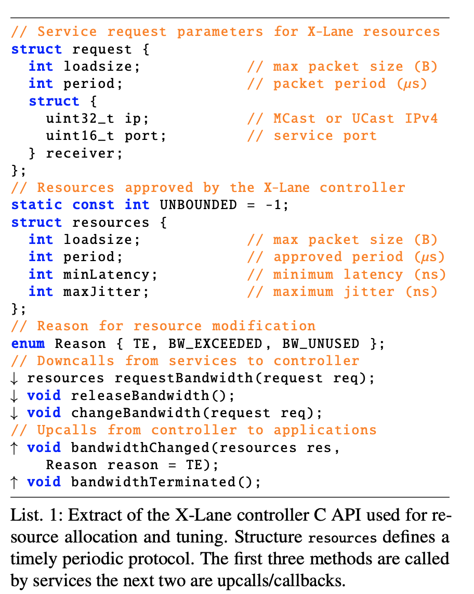

## 论文阅读

### Live in the Express Lane (ATC 2021)

#### motivation

大部分的分布式应用利用节点之间弱同步的方式来应对底层基础设施的不确定性。这种同步依赖于节点之间的有界传输延迟（bounded-latency)。如果能确保节点之间具有极低的交互延迟，并且抖动是有界(bounded)，将大大提升分布式应用的性能。特别是对于分布式应用里的协调模块, 例如 zookeeper。**（背景）**

但是目前的数据中心底层基础设施无法提供这种有界低延迟。因为目前数据中心底层基础设施主要由商用硬件(通用多核CPU)和软件(Linux内核)组成。在商用软硬件上并发执行的事务会对传输延迟造成无法预测的干扰。在该paper之前很多工作聚焦于低传输延迟，但并不能保证有界的抖动（bounded jitter)，无法消除商用软硬件对传输延迟带来的干扰。**（挑战)**

为了解决以上挑战，该论文提出了Express-Lane（X-lane)。X-lane 提供了个位数微秒级的传输延迟和纳秒级的有抖动，为分布式应用提供了无干扰的通信环境。

#### design 

X-lane的设计由两部分组成。

1. 通信模型的设计（即协议的设计),  通过协议层面的设计，以及packet级别的流量工程来减少丢包，降低排队延迟
2. 消除抖动源。

**通信模型** 

X-lane设计了周期性通信协议，要求数据的发送方以**特定的间隔**，**发送特定大小的packet**。在此限制下，X-lane为发送方提供了有界延迟的保证。该协议工作流程如下 ： 

发送方在传输数据前向X-lane客户端（X-lane客户端是一个内核模块）发送一个 request(包含 负载大小，发送周期等)。X-lane返回 resources ，即发送方必须遵守的协议参数。发送方根据协议参数发送数据。

X-lane实现了一个SDN控制器。X-lane通过限制发送方的发送速率以及发送报文的大小来实现网络资源分配（而非直接使用交换机分配链路资源）。抽象地说，对于一个request序列，X-lane根据网络的链路情况，分配对应的resources（对此论文进行了建模，并提出一个简单的分配算法）。随着网络环境的变化（例如，新发送者的加入），X-lane随时更新已分配的resources。

通过细粒度的网络资源分配，X-lane能够最大程度地降低报文的排队延迟。

**消除抖动源** 

仅有以上的通信模型设计和网络资源的分配是不够的，因为商用软硬件会引入不可预测的抖动。这也是这篇文章比较精髓的地方。为了消除抖动有两种方式。

1. 将X-lane实现在智能网卡上，也就是硬件卸载。这种方法直接将X-lane的流量和其它流量在硬件级别进行了隔离，显然能够消除影响
2. 将X-lane实现在商用软硬件（也就是普通的多核处理器+kernel），并通过各种手段消除干扰源。

重点在于第二种方式，主要设计包括： 

1. 将X-lane绑定到特定的CPU上。该CPU只运行X-lane，禁止其他任务的抢占。
2. 确保X-lane操作执行时间的有界。即避免CPU处理硬中断导致X-lane操作执行时间的不可预测。这个地方涉及到很多技术细节，例如屏蔽可屏蔽中断，关闭内核watch dog, 中断亲和力等。
3. 加速数据包从网卡复制到内存的时间。X-lane 1. 使用使用中断的方式（即一个数据包过来就发一次中断）而非poll的方式（定期轮训，一次处理一批）处理数据包。X-lane的通信模型保证，同时到达网卡的数据包个数是有限的，因此使用中断方式并不会影响性能。2. 将NUMA纳入考虑，选择网卡RQ对应NUMA节点上的CPU，加速数据包拷贝时间。

### 个人总结 

**优点** 

1. 场景找的很准。分布式应用的同步这一场景，要求有界低延迟，同时数据量很少。为此引出了周期性通信协议。
2. 在减少干扰源方面，充分考虑了体系结构以及内核技术细节。包括中断，DMA, NUMA 等。这方面值得学习，将一个工程问题转化为科学问题。

缺点： 

1. 使用的方法略显粗暴，通过绑定CPU，关中断，更改内核配置等方式。

## 课程学习

[陈莉君老师的Linux课程](https://www.bilibili.com/video/BV1Ut4y1n7xM/?spm_id_from=333.999.0.0&vd_source=4dddd7158464787d615193a40b415b99)  内存管理，进程，中断和中断下半部。 （这门课程我目前打算看到这里，主要是了解一些主要的数据结构，但是这门课内容有些残缺不全）， 笔记 

## eBPF技术研究

### 总结

