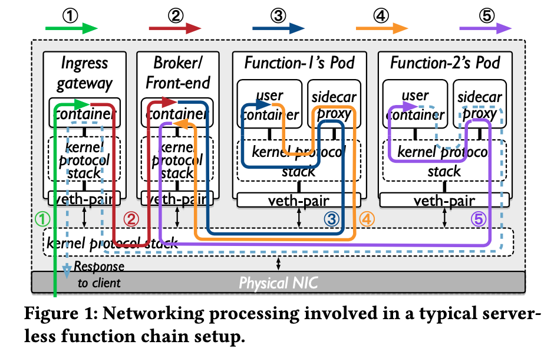
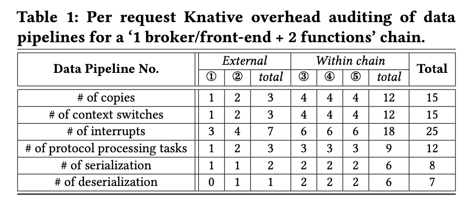
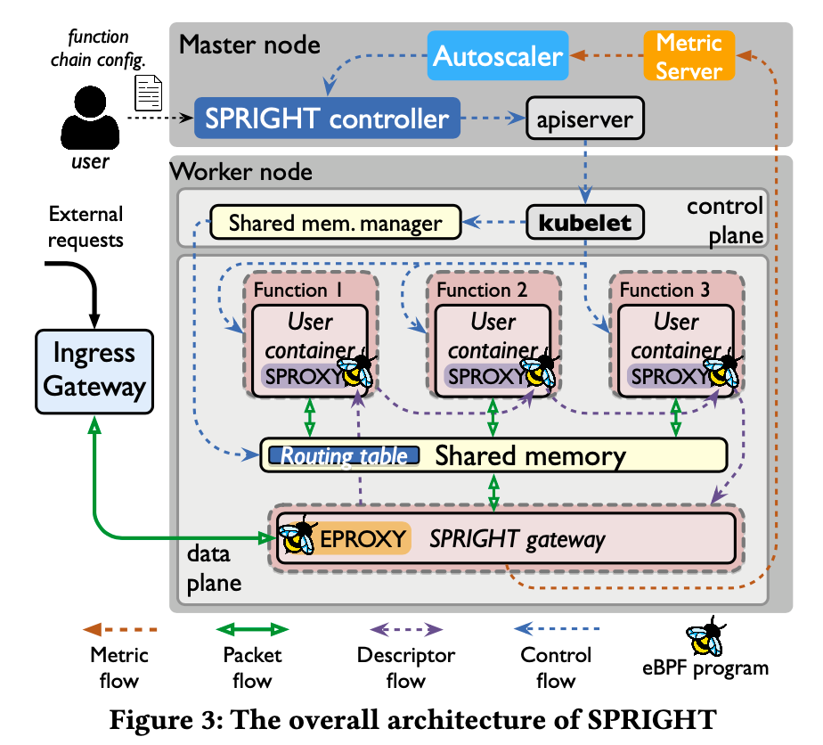
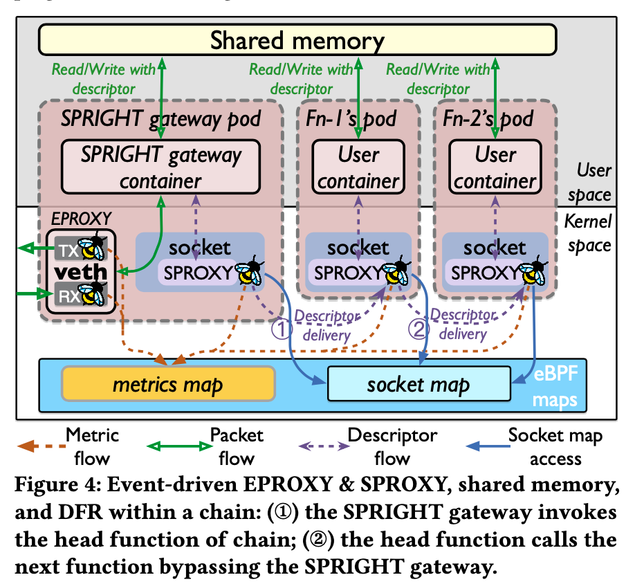
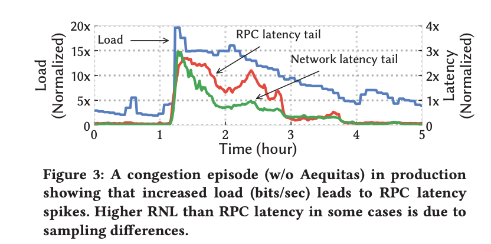
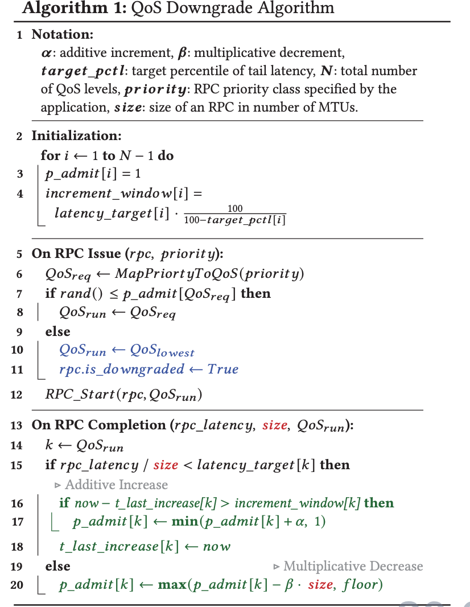

## 论文阅读

本周精读了2篇SIGCOMM2022的文章

1. SPRIGHT: Extracting the Server from Serverless Computing! High-performance eBPF-based Event-driven, Shared-memory Processing 利用eBPF技术优化severless computing(微服务架构)中的函数调用优化。系统文章。亮点在于核心idea以及写作技巧(对系统的描述非常有逻辑)
2. Aequitas: Admission Control for Performance-Critical RPCs in Datacenters. RPC粒度的 SLO 优化。亮点在于提出的问题，对问题进行理论分析，基于理论分析实现算法。

### SPRIGHT: Extracting the Server from Serverless Computing! High-performance eBPF-based Event-driven, Shared-memory Processing

#### motivation and core idea

Serverless computing（微服务架构，无服务计算）架构下，大型的应用可以分解为多个独立的组件(function)，不同的function运行在独立的容器/pod上，并通过松耦合的方式组成function chain。用户请求往往先到达用户网关，用户网关将请求路由到特定的function chain，该function chain上的function逐一对请求进行处理。在Serverless computing架构下，用户只需要关注function的实现，function之间的通信由底层基础设施负责。（背景） 

Serverless computing虽然提供了极强的开发灵活性，但在大部分情况下耗费了大量的资源。（挑战）这主要是因为现有的serverless computing架构： 

1. 使用了重量级的无服务组件（sidecar proxy）。sidecar proxy运行在独立的容器中，和function容器一一对应，代理function的流量以实现底层的网络通信和统计功能。然而sidecar作为持续运行的独立容器，但来了巨大的性能开销。首先，sidecar 容器独立于 function 容器，彼此的数据传输导致了额外的数据复制，序列化/反序列化，状态切换的开销。其次，由于sidecar持续运行，即使在低负载情况下仍然带来固定的额外开销。
2. function chain低效的数据路径。function运行在独立的容器中，并通过松耦合的方式(内核协议栈）彼此连接。这种方式虽然提供了灵活性却带来了巨大的额外开销。function容器和function容器之间的调用需要网络传输，带来了额外的数据复制，序列化/反序列化，状态切换，协议栈处理的开销。

通过对Serverless computing架构进行性能分析（表一），额外的性能开销包括： 

1. 过多的数据拷贝、上下文切换和中断。
2. 过多的、重复的协议处理。
3. 不必要的序列化和反序列化
4. 独立的、持续运行的重量级组件。

为了解决上述挑战，本文提出了无服务架构框架 SPRIGHT ，其核心idea包括: 

1. 基于eBPF技术的，event-trigger风格的无服务组件。（解决挑战1） 
2. 基于共享内存的function chain通信以降低function chain内部的开销。（解决挑战2） 

#### Design

(因为内容很多，我这里用我自己的话概括一下，fucntion chain之间的共享内存计算)

(前提，function chain的所有function位于同一个node上)

当function chain创建的时候，SPRIGHT controller 为每一条function chain创建一个SPRIGHT gateway 和 用户空间的共享内存池。请求首先到达SPRIGHT gateway, gateway负责该请求的协议栈处理，并将应用层负载保存到共享内存池中。之后gateway 调用function chain的第一个function。调用关系本质上是数据传递。

gateway 和 function 以及 function和function之间只传递packet 描述符（pfd)。pdf由两部分组成，1.下一个function的id以支持function之间的调用。 2. packet在共享内存池的地址。function根据地址可以直接访问并修改packet。

为了实现function之间的调用，即传递pfd给下一个function。SPROXY根据id，绕过内核协议栈将pfd发送给下一个function。具体实现的时候，SPROXY根据id查找 eBPF socket_map 找到下一个function的socket fd。然后使用eBPF的 socket_map_redirect 将 pfd直接发送给下一个function的socket，无需经过内核协议栈。

#### 总结与感悟

优点： 

1. 本文的行文逻辑从大的章节可以划分为  背景，设计 ，实验。背景在介绍无服务计算架构的同时，给出了令人信服的性能测试数据，并基于数据以及本身的机制引出无服务计算的limitation。 在设计章节，针对part 2提出的overhead, 逐点给出解决方案。并且在说明机制的时候结合图片和具体例子进行说明。我感觉本文可以作为系统论文写作的范文。
2. 核心idea, 基于eBPF sockmap redirect 技术的 共享内存 很有意思。

缺点： 

1. 工作类似于cilium 
2. 要求function chain 的function必须在同一节点上。

### Aequitas: Admission Control for Performance-Critical RPCs in Datacenters. 

#### motivation and core idea 

今天数据中心的流量主要由RPC流量组成。不同的RPC对性能(在本文中指延迟)有不同的要求，具有不同的SLOs(Service Level Objectives)。基于SLO, RPC可以被大致分为三类：PC(performance-critical), NC(Non-critical), BE(best-effort)。这三类RPC对延迟的需求依次降低。 在数据中心中，特别是在超载环境(overload)下，根据RPC的SLO实现性能隔离，尽可能地满足不同类型RPC的SLOs，是一个很重要的问题。(背景)

然而直接将现有的性能隔离工作应用在RPC上并不能实现最佳的性能（挑战一）。

1. 基于size的调度算法（最短工作优先和最少剩余时间优先)虽然能够降低平均RPC延迟，但无法保证不同RPC类别的SOL。因为此类算法基于RPC的size进行调度，但是RPC的size并不等同于RPC的优先级。优先级较高的RPC可能拥有较大的size。
2. 使用严格优先级队列，直接将RPC的类别映射为优先级。这种方案提供了直接的优先级映射，然而会导致饥饿现象并且让网络管理员倾向于将所有的RPC都设置为最高优先级(PC).
3. 使用加权公平队列(WFQ)。WFQ支持将流量优先级映射为QoS类别，并根据QoS类别实现公平的带宽共享。并且WFQ已经被实现在商用的交换机中。然而，（1）目前大部分的云提供商将来自同一应用的所有流量映射为相同的QoS，导致同一应用的所有RPC具有相同的QoS, 这种粗力度的映射并不能去的最佳性能(同一应用的RPC并非都是PC类别的RPC)。(2) QoS类别并不能直接保证SOL。

其次在超载环境下，缺乏对网络流量的准入控制，会显著降低RPC性能(挑战2)。例如对于WFQ来说，即使我们为不同的流量划分了QoS(QoS的类别越低，其分配的带宽资源越多）,如果低类别QoS流量数目太多的话，会导致延迟增加，延迟甚至会高于 高QoS的流量。

为了解决上述挑战，该文章提出了Aequitas。Aequitas提供了以per RPC为粒度的性能隔离机制，并且为不同优先级的RPC提供准入控制(admission control)，以保证网络超载环境下PC和NC类别RPC的SOL。

#### Design

为了实现RPC粒度的性能隔离。Aequitas基于底层交换机的WFQ,  并将三种类型的RPC (PC,NC,BE，分别映射为三个等级的QoS。但是对于WFQ来说，QoS只能保证分配的带宽，并不能完全保证SOL。不同QoS流量的延迟和同一时刻输入流量的QoS类型分布相关(paper在下一章给出了理论证明，理论证明见论文）。当超载现象发生，低QoS(高优先级)的流量徒增，随着低QoS流量的所占比例增加，延迟逐步增加。当所占比例超过一定阈值，低QoS流量的延迟甚至高于高QoS流量的延迟（QoS反转）。

因此为了确保不同类型RPC的SOL同时保证网络超载环境下的RPC性能，Aequitas通过对各个类别的QoS流量进行准入控制，确保不同QoS流量的合理分布(QoE-mix)。从而保证了高优先级RPC的SoL(延迟)。准入控制算法是Aequitas的核心，Aequitas采用基于准入概率的准入控制，并随着网络负载的变化调整准入概率。

Aequitas的整体工作流程如下：

1. 应用发起一条特定类型的RPC请求。
2. Aequitas根据将RPC类型映射为QoS。
3. Aequitas根据当前的准入概率 Aequitas probability 来决定是否使用当前的QoS。否则就将QoS降级
4. 当RPC结束时，Aequitas测量该RPC的RNL(RPC Network Latency, 可以简单理解为RPC完成时间)。并根据RNL来更新  Aequitas probability。
5. 如果RNL满足该RPC类型的延迟要求则增加 准入概率，否则降低准入概率。准入概率的更新采用加性增乘性减的方式（类似拥塞窗口的更新）。

ps : QoS的设置是以RPC为粒度。具体算法如下 ：

#### 总结与感悟

本文优点： 

1. 提出了RPC粒度的性能隔离。（不是应用力度，包粒度，流粒）
2. 证明了流量准入控制对于WFQ性能的重要性。
3. 提出了基于准入概率的流量准入控制算法
4. 对问题的本质进行了理论分析，并根据理论分析的结果指导系统设计。(这也是我本周看数据结构课程的一个感悟)

缺点： 

1. 个人认为行文逻辑稍显混乱。特别是第二和第三章。（上面的挑战我经过个人理解重新整理了） 
2. 虽然对问题本身进行了理论证明。但是并没有从理论上对给出的解决方案（算法）进行证明。

## 课程学习

数据结构课程： 

1. priority search tree 
2. range tree 
3. bootstrapping 
4. 平摊分析
5. semi-Dynamization : Logarithmic method

[笔记](https://github.com/chonepieceyb/my_PHD/blob/main/%E8%AF%BE%E7%A8%8B%E7%AC%94%E8%AE%B0/%E9%AB%98%E7%BA%A7%E6%95%B0%E6%8D%AE%E7%BB%93%E6%9E%84/my_note.md)

最大收获： 

1. 平摊分析通过设置 fake cost, 将大操作的开销，分摊到其它操作，从而实现了总体上的小开销。
2. 平摊分析只是一种分析方法。虽然从整体上来说开销是可接受的，但是并不能保证每一个操作的 bound-latancy。
3. 如果将平摊分析时的分析平摊方法进行实现，那么就可以保证bound-latancy。换言之，分析方法可以启发算法设计

例子： 

vector 低延迟扩容的实现。

## 技术研究

[eBPF map_create系统调用](https://github.com/chonepieceyb/eBPF-documentation/blob/bpf_struct_ops/Doc/Notes/eBPF_map_kernel/eBPF_map_kernel.md)

[eBPF map_update_elem系统调用](https://github.com/chonepieceyb/eBPF-documentation/blob/bpf_struct_ops/Doc/Notes/eBPF_map_kernel/eBPF_map_kernel.md)

[struct_op相关的源码](https://github.com/chonepieceyb/eBPF-documentation/blob/bpf_struct_ops/Doc/Notes/eBPF_map_kernel/Map_Ops_BPF_MAP_TYPE_STRUCT_OP.md)

