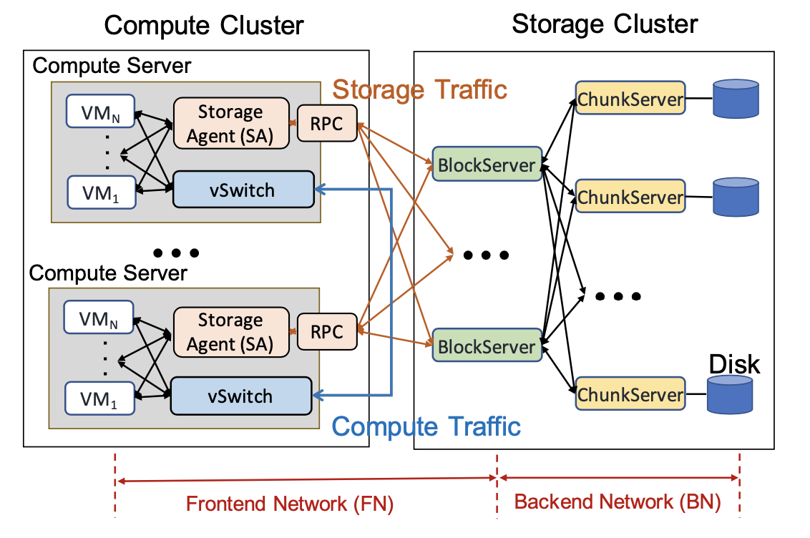
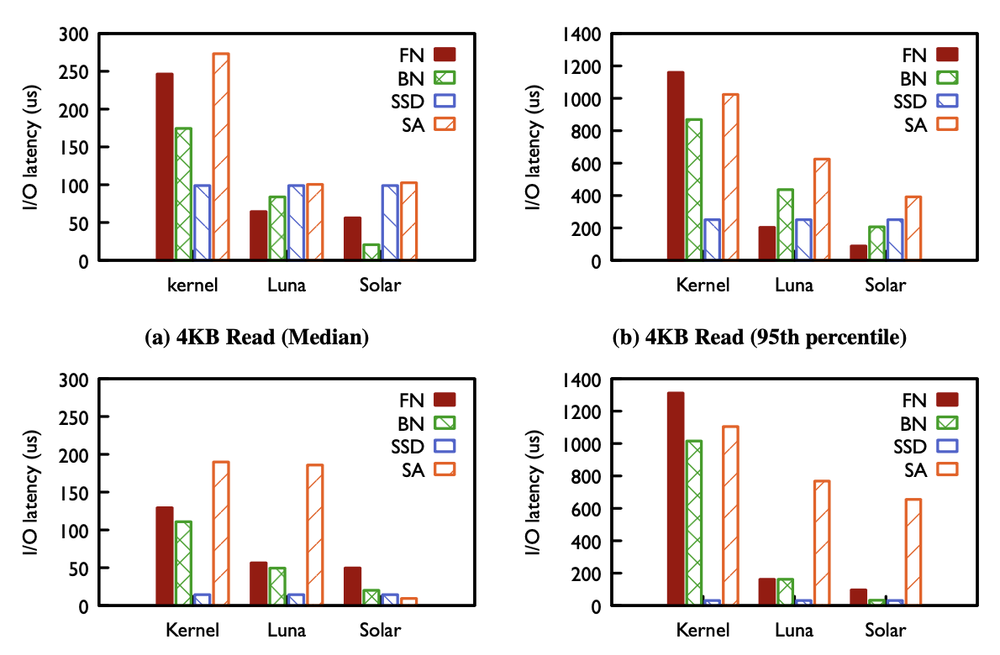
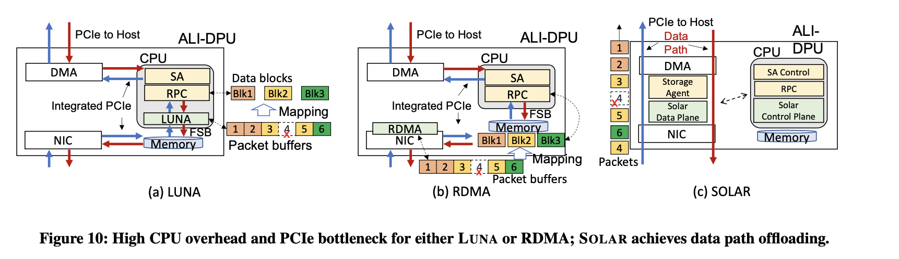
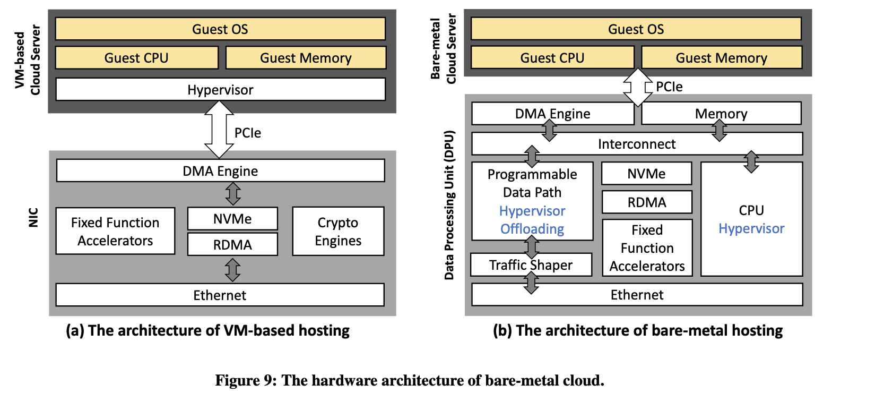
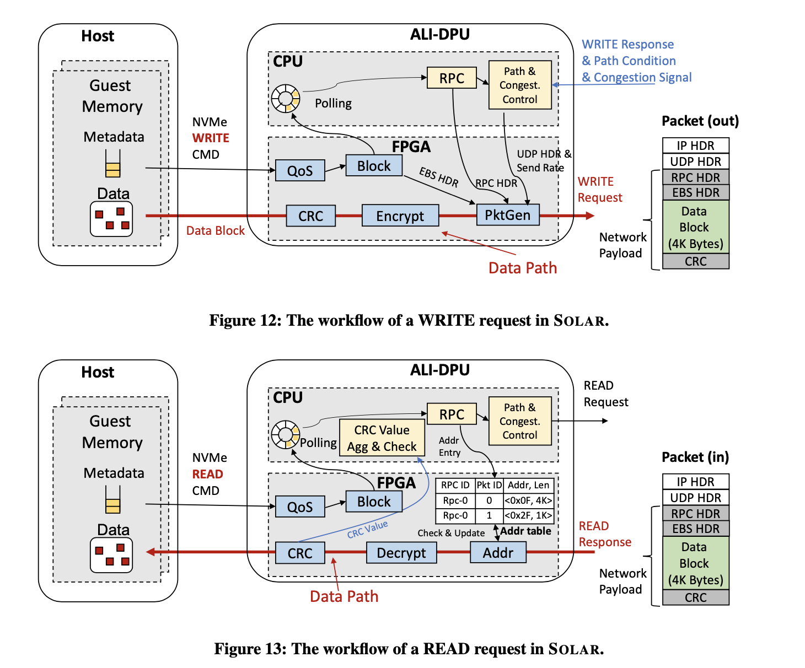

## 论文阅读

本周精度一篇sigcomm2022系统文章 ： From Luna to Solar: The Evolutions of the Compute-to-Storage Networks in Alibaba Cloud

* 背景 ： 数据中心存算分离架构下网络传输优化
* 核心idea : 通过协议层面的重设计。将packet和block一对一映射，实现网络传输pipeline和ESB(Elastic Block Storage)处理pipeline进行融合并减少协议处理的复杂度(无需进行packet buffering 和 reording)。从而将网络协议栈和ESB处理协议栈同时卸载到硬件中（DPU)。解决了传统架构下，内核网络栈和Storage Agent(SA)处理时间导致的瓶颈问题。
* 选择这篇文章的理由 : 
  1. 补充我对存算分离架构的理解
  2. 巧妙的设计(将packet和block一对一映射)降低了协议复杂度，为硬件卸载提供了可能性。(stateless的计算比较适合卸载到硬件上，传统TCP协议栈复杂的状态机模型并不适合硬件卸载)
  3. 优秀的写作逻辑。是层层递进式叙述逻辑的范文。

### From Luna to Solar: The Evolutions of the Compute-to-Storage Networks in Alibaba Cloud

**Motivation and core idea**

弹性块存储 (EBS) 是一项基础服务，可向云用户提供虚拟化磁盘 (VD) 中的持久数据托管。如今存算分离架构已经被多数云提供商采纳作为EBS的基础架构。在存算分离架构下，计算节点和存储集群之间的联通性能成为了影响EBS的瓶颈。EBS服务底层网络的**可靠性**和延迟有着更高的要求。

存算分离的整体架构如下图所示： 

该架构： 

1. 将计算节点和存储节点放置在不同的集群中。由此计算集群和存储集群可以独立地设计和优化。
2. 网络通信对于存算分离架构至关重要, 因为计算集群所有的I/O请求都需要通过网络到达存储集群。
3. 存算分离架构的EBS有两种类型的网络，分别是（1）前端网络(FN)负责连接计算和存储节点 (2)后端网络(BN)负责在存储集群内部提供网络联通性。FN和BN对于网络的需求不同，本文主要优化FN,  BN统一使用RDMA。
4. 该架构下，Guest VM的IO请求首先经过SA的处理，SA通过FN讲请求以RPC的方式发送到存储集群。存储集群处理请求并将请求通过BN发送到不同的存储服务器，最后汇总结果将结果返回给SA。

(以上为背景)

然而现有的网络架构不能很好地满足EBS对于底层网络的需求 : 

**随着高速SSD取代HDD(机械硬盘)作为底层的存储介质，内核网络栈成为了EBS IO延迟的瓶颈。** 该论文将传输延迟的组成部分进行了详细的分析，结果如下图所示(在比较图中，kernel里FN和BN都使用了内核网络栈) ： 

可以看到内核网络栈的处理时间远高于SSD的IO时间成为了延迟的瓶颈。

**使用RDMA作为FN不能满足scalability和interoperability的需求。**相比于BN, FN认为scalability和interoperability有更高的优先级。FN需要更好的scalability，相比于存储集群（存储集群的数量较少，集群内部的服务器数量也较少) ，计算节点数量庞大，因此一个存储集群的服务器往往要承担成千上万的来自计算集群的兵法连接，这就要求随着规模的增大FN仍然要保持高性能。FN需要更好的interoperability, 由于不同的计算和存储集群是在不同的时间构建的，因此它们通常具有不同的硬件配置。因此，FN 必须提供强大的兼容性。然而现有的RDMA技术不能满足上述需求。随着连接数增加，RNIC的吞吐量会出现显著下降, 无法提供scalability。RoCE也有着严重的兼容性问题，不同厂商的RNIC，甚至是同一厂商不同modle的RNIC不能彼此兼容。因此RDMA也无法满足**interoperability**的需求。

**基于软件的用户层协议栈Luma解决了协议栈的瓶颈问题，但是SA的处理成为了新的瓶颈。同时Luma也无法应对常见的网络传输错误给存储带来的灾难。** 为了解决网络协议栈带来的瓶颈, 论文首先提出了 Luma, 这是一个类似mTCP和QUIC实现的用户层传输层协议栈。实现了zero-copy的优化。（文章没有详细讲luma)。成功将协议栈开销降低到SSD的水平，优化了EBS的整体性能。但是随着Luma的提出，SA处理需要的巨大的CPU开销，成为了EBS IO延迟的新的瓶颈。同时由于Luma不支持多路径传输，当网络出现故障时，无法选择新的路径绕过故障交换机节点，导致Luma面对常见的网络传输错误给存储带来的灾难时无能为力。

**现有的硬件卸载方案(bare-metal),严重依赖于DPU的CPU模块并引入了额外的PCIe传输导致了性能降低**。这是因为现有的硬件卸载方案(bare-metal)只卸载了协议栈，没有卸载SA因此也无法完全绕过DPU的CPU。

(以上为挑战)

为此，该paper提出了Solar架构，该架构主要解决两个问题： 

1. 能够将协议栈和SA一起卸载到硬件上。
2. 能够通过主动更改路径来检测和避免网络内故障。

**Solar Design**

核心idea : 通过重新设计协议，降低协议处理和SA的复杂性。

之所以无法同时将协议栈和SA卸载到硬件上，是因为现有的协议涉及过于复杂。例如现有的可靠字节流传输协议（例如TCP）需要维护复杂的状态机缓存packet以保证可靠交付。为此SA需要维护复杂的packet-block映射关系和状态机导致了计算的复杂度。然而对于EBS来说，EBS不同block彼此之间是独立的，处理流程也是独立的。并不需要如此复杂的传输协议。

因此，该论文提出，**将packet和block一对一映射**，一个packet代表一个block(4k)，packet和packet之间彼此独立。因此不需要协议栈维护复杂的状态机以及缓存packet实现有序交付。于此同时SA不需要维护复杂的映射关系。在有效降低计算复杂度之后，Solar可以将协议栈和SA进行融合并卸载到硬件中。并且由于packet和packet之间彼此独立，Solar有效解决了多路径传输乱序导致的性能下降问题，有效地利用多路径传输提升吞吐量和提升链路鲁棒性以应对可能发生的网络故障。

## 课程学习

1. 数据结构课程 weight balancing （这一部分都看完了） [笔记](https://github.com/chonepieceyb/my_PHD/blob/main/%E8%AF%BE%E7%A8%8B%E7%AC%94%E8%AE%B0/%E9%AB%98%E7%BA%A7%E6%95%B0%E6%8D%AE%E7%BB%93%E6%9E%84/my_note.md)
2. 准备申博材料

## 技术研究

1. struct op 研究，基本弄清楚要添加struct_op 需要的步骤。 [笔记](https://github.com/chonepieceyb/eBPF-documentation/blob/master/Doc/Notes/eBPF_map_kernel/Map_Ops_BPF_MAP_TYPE_STRUCT_OP.md)

2. 用eBPF struct op 实现拥塞控制源码。[笔记](https://github.com/chonepieceyb/eBPF-documentation/blob/master/Doc/Notes/eBPF_TCP_ca/eBPF_TCP_ca.md)