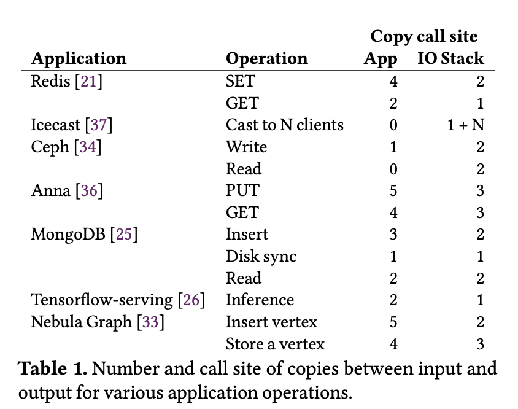
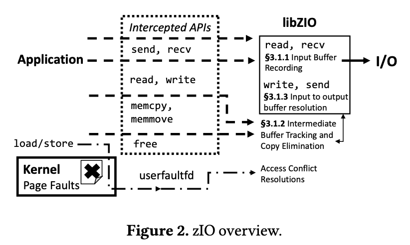
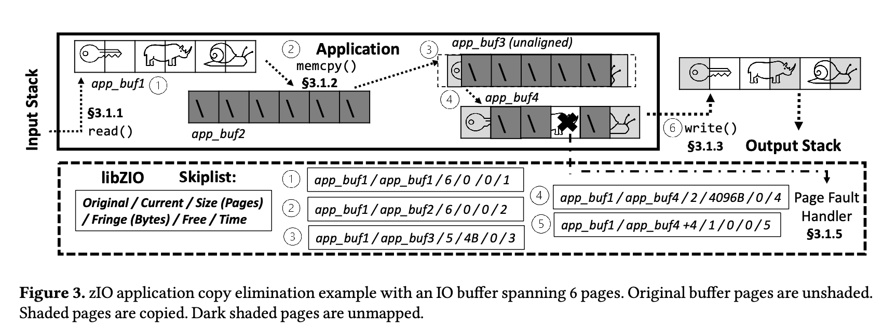

# 论文阅读

本周精读OSDI 2022文章 zIO: Accelerating IO-Intensive Applications with Transparent Zero-Copy IO

背景 ：I/O密集型应用程序内部模块之间，应用程序和I/O stack之间的数据拷贝优化

核心idea: 该文章的idea基于一个核心假设： I/O密集型的应用通常只访问他们要处理数据的一部分（IO-intensive appli- cations often touch only a part of the data they process.）。其核心idea就是将数据复制这一过程尽量推迟。当发生数据拷贝的时候，并不进行数据拷贝，而是将拷贝的操作记录下来。当真正使用这些数据的时候，再从源地址讲数据复制到目的地址。通过消除大部分数据的复制开销来提升性能。

选择文章的原因： 

1. 其实现方式和之前我们想要利用eBPF去拦截某些系统调用的想法很像
2. zero-copy对于构建高效的数据路径很有参考价值
3. 核心idea很有意思

### zIO: Accelerating IO-Intensive Applications with Transparent Zero-Copy IO

**Motivation and core idea**

零拷贝 I/O一直是一个长期的性能优化目标，复制副本会引入额外的内存和CPU开销，从而限制I/O密集型应用的性能。尽管在设计应用程序的时候，使用zero-copy I/O能够在极大程度上提升性能，现有的多种具有代表性的I/O密集型应用，例如redis, MongoDB仍然需要大量的拷贝操作(作者通过静态代码分析和实验得出这一结论)。如下图所示。在引入的数据拷贝（或者说是I/O）中有主要两种类型：1. 应用拷贝，即应用程序内部子系统之间的数据拷贝；2. IO栈API拷贝。即应用程序调用系统调用例如, read, write所引发的用户态和内核之间的数据拷贝。其中第一种类型的拷贝在总拷贝数占据了大多数。之所以现代I/O密集型应用引入了大量的应用内拷贝，主要是从软件开发的角度出发，划分子系统并通过数据拷贝实现子系统之间的数据解耦，避免实现复杂的内存所有权管理和同步机制，极大地降低了开发的复杂度。因此如何优化IO密集型应用的应用间拷贝和IOstack拷贝对提升性能至关重要.(背景和研究目标)

现有的很多研究工作，以及现有的Linux内核在实现zero-copy上做出很多工作，例如Linux网络协议栈提供了zero-copy send和zero-copy recv，RDMA技术也支持zero-copy。然而现有的工作存在很多局限性： 

1. 对应用程序不透明，往往要求应用程序修改源代码使用特殊的zero-copy API。相比于标准API，zero-copy API在不同平台上支持程度不一致。
2. 增加额外的开发复杂性，例如部分API调用需要进行缓冲区所有权管理。
3. 在功能性上存在着很多限制，例如要求缓冲区对其页面大小(page-aligh), 不允许就低更新等等。

(局限性和挑战)

本文基于以上的背景和挑战，提出了zIO, 一种对应用程序完全透明，能够优化应用间拷贝和IO stack拷贝的数据拷贝优化技术。

**design** 

基础假设： I/O密集型的应用通常只访问他们要处理数据的一部分

核心idea: 就是将数据复制这一过程尽量推迟。当发生数据拷贝的时候，并不进行数据拷贝，而是将拷贝的操作记录下来。当真正使用这些数据的时候，再从源地址将数据复制到目的地址。通过消除大部分数据的复制开销来提升性能。

支撑技术： linux userfaultfd。该技术是 kernel 中提供的一种特殊的处理 page fault 的机制，能够让用户态程序自行处理自己的 page fault。

系统设计思路(消除应用内拷贝)：

1. 拦截、跟踪并记录应用程序内部的数据拷贝行为。

   * 当数据从input IO stack读入应用程序缓冲区的时候的时候, zIO记录下该缓冲区的信息称为源缓冲区(source buffer)。

   * 当zIO拦截数据复制操作的时候(例如，memcopy)，如果拷贝操作是对zIO维护对象（例如 source buffer)，zIO舍弃这次拷贝，并将这次拷贝的信息：源地址、目的地址、复制大小等记录下来，而拷贝操作的目的buffer称为 intermediate buffer (中间buffer)

2. 核心数据结构 skiplist (跳表，redis的zset也是用了该数据结构，和红黑树不同，该数据结构基于概率实现高效的查询，很有意思的一种数据结构)。zIO使用skiplist维护记录的信息，包括源buffer信息和intermediate buffer信息。跳表里的记录格式如图3所示，包括，源地址，目的地址，buffer所占页的大小，边界大小(后面会解释), 是否已经被释放，使用时间戳等。skiplist的记录实际上保存了源地址和目的地址的映射关系，以实现当真正需要使用数据的时候，**将一小部分**数据从源地址复制到目的地址。

3. 解决访问冲突。由于zIO只保存了内存拷贝操作的映射关系并没有真正执行数据复制。该技术的核心如何解决当应用程序访问intermediate buffer时候导致的冲突问题。实际上，当应用程序访问intermediate buffer时，由于并没有真正执行数据复制，会产生page fault。基于userfaultfd zIO能够自定义page fault处理程序。当page fault发生的时候，zIO查找skiplist，根据映射关系查找 访问的intermediate buffer page在source buffer里所对应的page 并执行数据复制。(核心思想还有很多技术细节不展开了)。zIO的数据复制以page为粒度。

4. page aligh问题。如上所述，zIO在解决访问冲突时是以page为粒度的，但用户程序的buffer地址和大小并不都是page aligh。为了解决这一问题，zIO只在core pages的范围内消除拷贝，core pages指的是buffer内部位于完整的page的部分，用start来表示开始地址，end表示结束地址，core pages范围如下[round_up(start), round_down(end)]。而core page之外的范围，zIO直接将数据从source buffer复制到 dest buffer，并将边界偏移信息记录到skiplist对应的记录中。

5. 垃圾回收。zIO同时拦截所有的free操作，对于zIO所维护的buffer, 如果是 intermediate buffer直接从skiplist删除对应记录，如果是source buffer则并不会直接回收内存，而是在记录中设置free标记，交给垃圾回收进程回收内存。垃圾回收进程的作用除了回收内存避免内存泄漏，**还负责维护skiplist的大小以确保查询性能。**垃圾回收进程，根据free标记或者时间戳来进行回收。当skiplist过大时，垃圾回收进程会使用类似LRU算法释放部分记录，如果被释放的记录没有free标记，垃圾回收进程会扫描skiplist以完成对应的数据拷贝。

（消除IOstack的思路和消除应用内拷贝思路类似，本文主要篇幅在于消除应用内拷贝) 

**个人想法**

这项技术和最早我们想要使用eBPF跳过函数某些过程很像。这篇文章的idea给我一个启发： eBPF的tracking不仅仅可以用在观测上，也可以像这篇文章一样，用来记录各种调用信息（参数），并且之后可以考虑为eBPF添加新的function使其能够完成拦截的功能。进而参考该文章设计高效的数据路径。

文章的核心idea很有意思，但是如果从工程角度出发，需要考虑很多鲁棒性问题，和技术细节。

## 课程学习

1. 撰写攻博计划书
2. 整理硕转博材料

## 技术研究

1. 研究 BPF_HASH_MAP的源码。为之后自己写MAP做准备 [笔记](https://github.com/chonepieceyb/eBPF-documentation/blob/bpf_hash_kern/Doc/Notes/eBPF_map_kernel/Map_Ops_BPF_MAP_TYPE_HASH%20.md)
2. 阅读一些kernel必要的开发文档，为之后自己写MAP做准备

