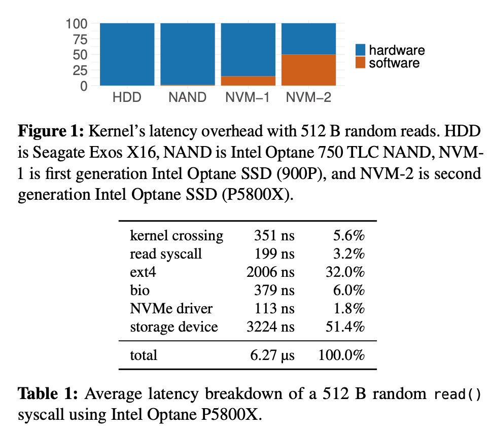
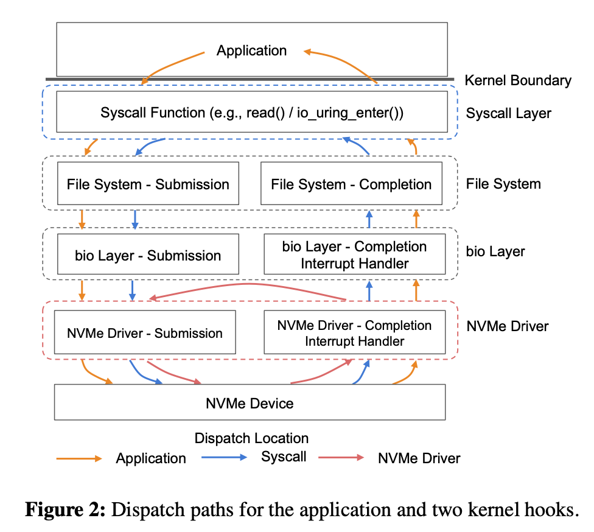
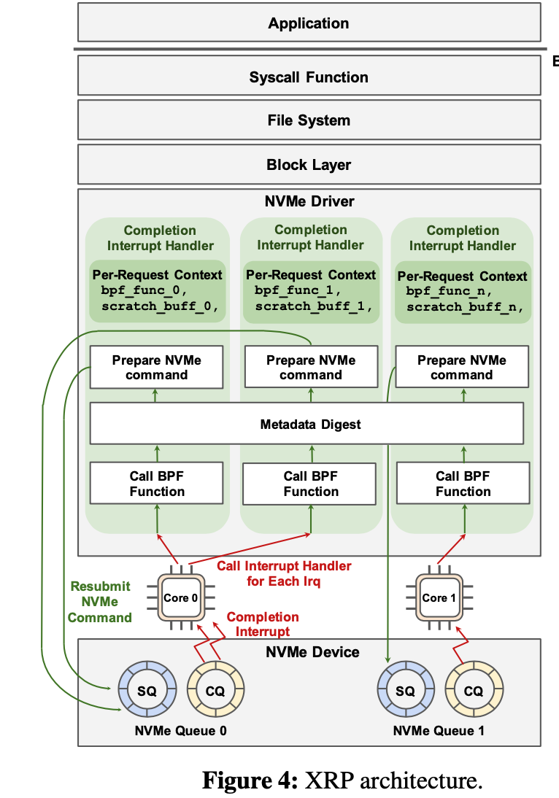
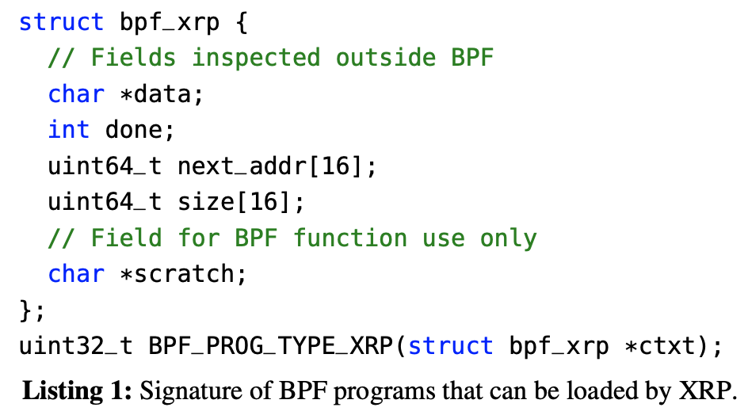
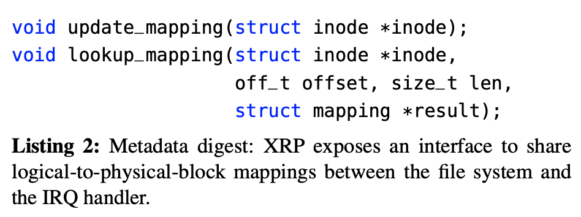
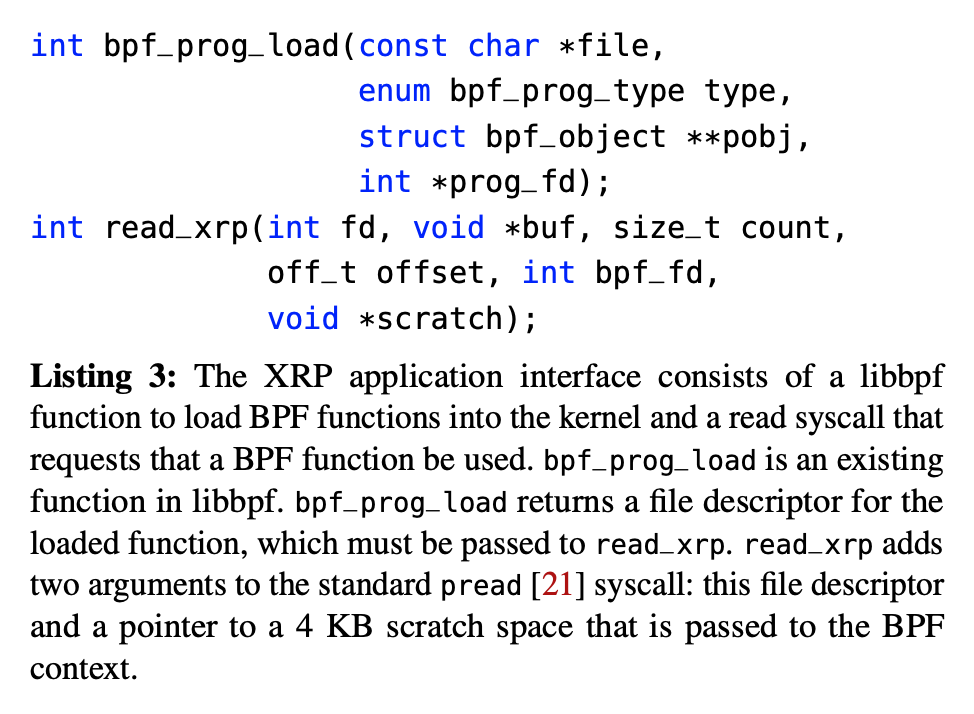
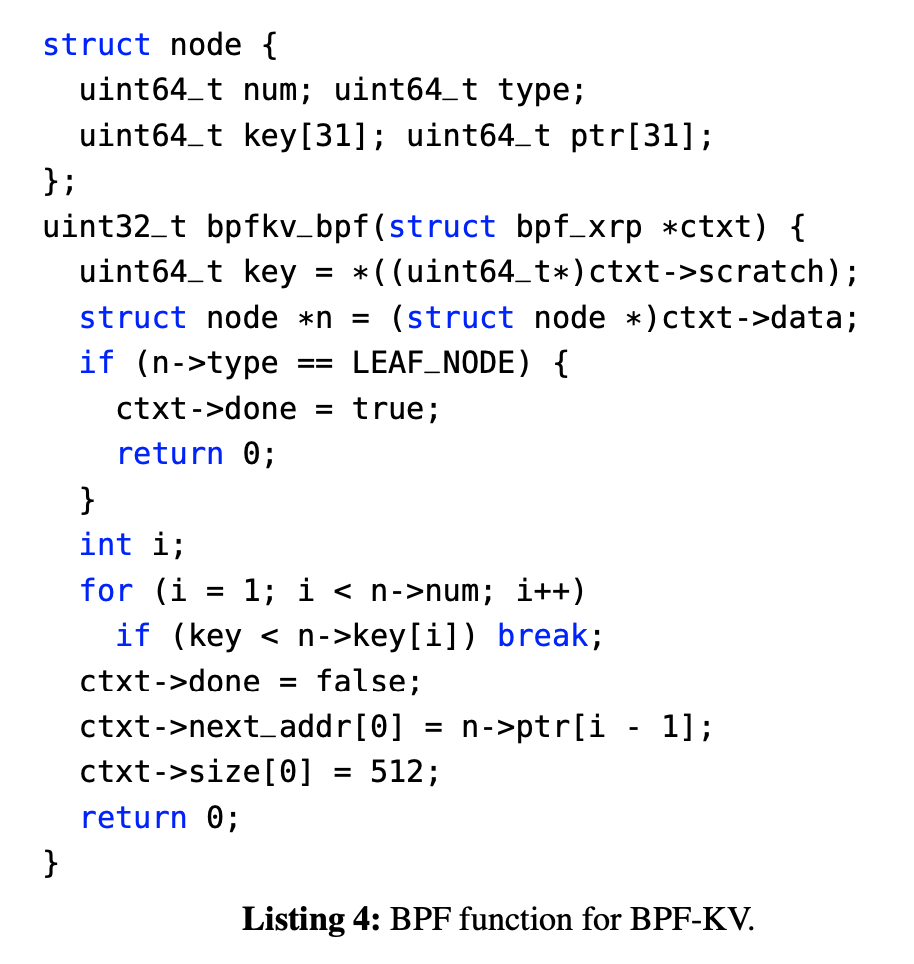

## 论文阅读

精读OSDI2022论文： XRP: In-Kernel Storage Functions with eBPF

背景：随着硬盘访问速度的提升，内核I/Ostack已经成为了IO的瓶颈(约占总访问时间的50%)，现有的kernel-bypass方案，例如SPDK通过完全绕过内核来进行IO优化，但是这种方案需要用户开发自己的文件系统，缺乏隔离性，带来了较高的CPU开销(基于 poll的方式）。因此如何更好地优化内核在IO上带来的巨大开销是一个重要的研究问题。

核心idea: 内核存储栈和内核网络栈在一定程度上是很相似的，该paper参考内核网络栈中的XDP技术，提出了XRP(eXpress Resubmission Path)。该框架允许应用程序从NVMe 驱动程序中的 eBPF hook执行用户定义的存储函数（例如索引查找或聚合），安全地绕过大部分内核的存储栈。

选择该文章的原因： 

1. 和eBPF技术高度相关，并且和之前看过的利用现有eBPF机制的文章不同，该文章属于扩展eBPF功能，即针对优化内核存储栈这一场景，在存储栈中添加新的eBPF hook已经相应的eBPF程序类型。对之后的研究有很大的借鉴价值
2. 该论文的工作开源，并且star数目较多，我感觉有潜力将来会被upsteam到内核中
3. 该论文实现内核栈 遇到的挑战以及解决挑战的方法，和我之前想到的一个进一步优化网络栈以实现pre stack cache的idea(在读该文章之前)很像，很有借鉴价值。
4. 整体文章的写作顺畅，思路清晰，之后写作相关的eBPF文章时可以作为重要参考。

### XRP: In-Kernel Storage Functions with eBPF

#### **background and motivation** 

**存储技术快速发展导致内核存储栈成为存储IO的瓶颈** 

随着存储技术的不断发展，内核存储栈已经成为访问存储设备的主要性能瓶颈。如下图所示，对于NVM-2设备来说，软件的开销（内核存储栈的开销）占据总开销的近50%(48.6%)，在软件开销中，占比最大的是文件系统的开销。优化内核存储栈导致的IO瓶颈是本文主要的优化目标。

**kernel-bypass的存储优化方案存在很多问题** 

kernel-bypass的方案例如SPDK是现有的解决内核存储栈瓶颈的技术方案。(该方案类似网络里的DPDK)。该方案取得了很好的优化效果，但是并不是万能的，其主要弊端包括： 

1. 在kernel-bypass方案下，用户获得了对存储设备的底层访问权。导致用户（1）必须实现自己的文件系统 (2) 对于访问统一设备的不同应用无法实现细粒度的性能隔离。
2. 在该技术方案下，用户态程序没有接受I/O完成时中断的有效手段，因此kernel-bypass方案必须使用基于poll的方案来访问设备，导致了较高的CPU开销。(在I/O密度较低的时候，poll浪费了CPU)
3. **当同一个CPU上运行多个poll线程时，导致所有poll线程的性能下降**

**利用eBPF优化存储栈的潜力** 

eBPF是一种允许在内核态运行用户态代码的技术。和kernel-bypass相似，通过将应用程序逻辑下沉到内核，eBPF消除了内核态和用户态空间数据交换和状态切换的开销。和kernel-bypass不同，eBPF由操作系统底层支持的、基于event-trigger,支持更强的隔离性、安全性以及较低的CPU开销。基于以上特性，本文基于eBPF优化内核存储栈。

**eBPF主要优化了用户态和内核态的数据传输和状态切换，因此利用eBPF优化存储栈必须紧紧围绕这一eBPF重要的优化特性。**存储设备在进行逻辑查找操作时候，往往需要一连串的辅助I/O请求序列，这些辅助I/O请求产生了**中间数据**，这些中间数据并不是用户需要的最终的查询结果。例如对B+树索引进行查询，搜索路径就是一连串的I/O请求，搜索路径上的中间节点相当于中间数据，叶节点相当于用户所需要的最终数据。这些辅助I/O都需要经历完整的内核存储栈带来了巨大的开销。针对该场景，由于中间数据并不是用户所需要的，完全可以利用eBPF操作将辅助I/O操作下沉到内核中执行，即使用eBPF程序来完成这些辅助IO，从而极大地优化性能。(核心idea)

基于上述核心idea, eBPF程序可以放置在内核存储栈的任意一层。显然，eBPF程序处于越底层的位置，其性能越好（因为越底层的位置饶过了越多的内核函数）。因此，XRP实现在了NVMe驱动层。

**利用eBPF优化存储栈的挑战** 

将XRP实现在NVMe的驱动层是最佳的设计选择。但是这也带来了很大的挑战。

1. (挑战1）地址翻译问题和安全性。由于驱动层位于文件系统层之下，**无法访问上层文件系统的元数据**。因此在驱动层无法直接实现逻辑地址和物理存储快地址的转换和映射（eBPF程序只能活的逻辑地址/逻辑偏移量，必须进行地址转换，而该步骤需要文件系统的元数据)。
2. (挑战2）并发和缓存问题。从文件系统发出的写入只会反映在page的缓存中，这对 XRP 是不可见的。此外与读取请求同时发出的任何修改数据结构布局的写入（例如，修改指向下一个块的指针）都可能导致 XRP 意外获取错误数据。

#### **design** 

XRP设计并实现在了NVMe驱动层，利用eBPF程序完成辅助I/O操作，让大部分的I/O饶过了内核存储栈并优化了性能。该设计的思想很容易理解但其关键在于解决以上的两个挑战。(地址翻译问题，并发和缓存问题)。

**重要观察** 

解决上述两个挑战需要基于本文提出的一个重要观察： 

**大部分存储在磁盘上的数据结构的布局（例如，B+树的指针）都是稳定的**。例如，对于LSM，一旦在磁盘上写如何索引文件，这些索引文件就不会再被更改。而对于B+树来说，其索引文件的更改频率也很低。

**整体框架和执行逻辑** 

如上图所示，XRP基于resubmission logic重新构建了 NVMe 中断处理程序（interrupt handle），该重提交逻辑由几个部分组成： 1. eBPF hook 2. 文件系统地址翻译(解决挑战1和2). 3 构建新的辅助I/O请求并，并将请求提交到NVMe。其执行流程如下： 

1. 当一条NVMe请求完成时候，设备产生一个中断，触发中断处理程序。
2. 中断处理程序中，XRP调用挂载的eBPF函数，该eBPF函数以`struct bpf_xrp`作为输入的参数(包含着数据内容以及其他元信息)，有eBPF函数进行数据的处理，并获得下一个数据块的逻辑地址
3. 调用完eBPF函数之后，XRP调用元数据摘要模块，**和上层的文件系统进行通信**, 并将逻辑地址转化为下一次查询的物理地址
4. 最后XRP生成并提交下一个NVMe请求。

**eBPF接口设计** 

1. XRP引入了新的eBPF程序类型 `BPF_PROG_TYPE_XRP` 其
2. XRP程序的输入(bpf context)是 `struct bpf_xrp`其字段含义如下： 
   * data : 存储的数据
   * done ：标志着是否完成IO, 即所有的辅助IO都已经完成，可以直接将数据交付给应用程序
   * next_addr。下一次请求要访问的物理块的逻辑地址，被元数据摘要模块使用完成地址翻译，并生成新的IO请求。XRP支持fans-out（简单理解，对于树结构支持多个叶节点，因此这里是一个数组） 
   * size, addr的长度
   * scratch, 只有XRP BPF程序使用的私有数据片段。XRP利用该数据块实现，XRP程序之间的，以及XRP程序和用户态程序之间的数据交换。功能类似于XDP程序的data meta。

**元数据摘要技术** 

XPR利用元数据摘要模块来解决之前提到的两处挑战，**元数据摘要模块本质上是XRP和文件系统层的通信手段**。该模块其实是由一下两个核心API组成：

1. update mapping: 当逻辑地址和物理地址映射关系发生改变的时候，在文件系统中调用更新函数。
2. lookup_mapping: 当BPF程序完成处理时，XRP调用该函数完成逻辑地址到物理地址的翻译（解决挑战1)

由于XRP的设计前提是磁盘上的数据结构分布是相对稳定的（基于此前提到的重要观察）。因此update_mapping发生频率并不高，但是一旦发生udpate和lookup冲突，XRP采用回滚的方式解决。由于冲突的频率较低，所以并不会影响整体的性能。（解决挑战2） 

#### Use case 

利用XRP实现存储查询操作，主要基于以上两个API 

1. bpf_prog_load: 加载XRP eBPF程序
2. read_xrp: 代理read系统调用，加载的XRP eBPF程序完成lookup的操作。

以下是本文给出的机遇XRP实现 B+Tree Key-value存储查询的use case ： 

## 技术研究

1. 深入研究了eBPF hash的实现(主要部分已经阅读完成)，[笔记](https://github.com/chonepieceyb/eBPF-documentation/blob/bpf_hash_kern/Doc/Notes/eBPF_map_kernel/Map_Ops_BPF_MAP_TYPE_HASH%20.md)。并研究了BPF_HASH是如和解决并发问题的（这个问题对于数据结构来说很关键），得出以下结论： 

   1. 如果在eBPF程序允许操作MAP的话 那么 该程序必须运行在 RCU section 

   2. HASH 的 update , delete 和 lookup 通过 RCU机制实现同步，RCU保护的是 bucket list（桶的链表) 

   3. HASH在 delete 和 update 会获取HASH bucket的锁

   4. 结论： 两个不同的eBPF程序, 对同一个元素执行一下操作
       （1）update + update  无风险(通过 bpf_map_update_elem 更新整个元素) 
         (2) update + delete 无风险 
         (3) lookup + update 无风险。因为RCU机制的存在，当一个eBPF程序调用lookup该元素的指针是收到保护的。如果另一个程序 使用 update。则使用lookup的eBPF程序仍然看到的是它lookup之前的元素。 update实际上是把整个元素替换掉了。lookup指的是 查询之后接着使用该指针
         (4) lookup + delete 无风险 同上
         (5) update(by pointer) + update 无风险
         (6) update(by pointer). + update(by pointer) 由于RCU保护的是 HASH的 bucket链表，因此如果两个eBPF程序并发地对同一个元素使用指针进行操作的话，一定会有同步问题。必须使用 bpf_spinlock 来解决同步问题

2. 阅读[kernel RCU文档]("https://docs.kernel.org/RCU/whatisRCU.html#rcu-overview"), 并学习RCU API的使用，之所以学习RCU，因为eBPF主要是基于RCU实现并发控制，因此学习RCU对于扩展eBPF至关重要
3. 学习kernel其他核心API的使用，例如list和hash API的使用。（这些API对与后续内核开发也是至关重要的）

## 课程学习

1. 数据结构课程
2. 做申博ppt 
