## Overview

本周工作主要是： 

1. eBPF硬件卸载调研（主要包括两篇文献的阅读）和相关技术调研
2. 小组会和大组会ppt制作
3. 准备申博面试

## 论文阅读（eBPF硬件卸载到FPGA相关） 

### hXDP: Efficient Software Packet Processing on FPGA NICs(OSDI2020)

这篇文章是eBPF硬件卸载的代表性文章，该文章将eBPF XDP程序卸载到了FPGA上执行。其贡献在于： 

1. 提出了eBPF线性执行模型并不适用于FPGA(即eBPF指令逐条执行，适用于高频率的服务器CPU，FPGA本身频率不高，但是支持硬件上的并行计算)
2. 为了将eBPF卸载到硬件上，设计了：
   * 用户态的调度器(编译器), 对eBPF字节码进行分析，实现指令级别的并行化调度。
   * 完成的硬件实现(自包含的IP核)，包括
3. hXDP占用极少的(9%)的FPGA硬件资源，在同一FPGA上集成多个硬件加速模块

**eBPF硬件卸载的最大挑战** 

1. eBPF硬件卸载的最大挑战在于，eBPF顺序执行模型和FPGA低频CPU不兼容，导致直接在FPGA上顺序执行eBPF性能远不如在服务器CPU上执行eBPF程序。因此必须在FPGA上实现eBPF程序的并行执行，以提升卸载性能。
2. 现代硬件加速顺序指令执行的手段主要有，超标量流水线，乱序执行，指令并行技术的硬件实现过于复杂。实现在FPGA上过于浪费FPGA的资源。

hXDP通过软硬件协同设计解决了这一挑战。

**hXDP编译器/调度器** 

hXDP编译(调度器)在eBPF指令级别(eBPF字节码)进行优化，优化目标包括 1. 移除无用的指令(例如eBPF程序中的边界检查指令) 2. 扩充指令集，例如增加parm_exit，并进行指令替换降低指令数目。3. 通过静态分析实现eBPF指令级别的并行化计算。

移除无用指令例子： 

（下列指令会被移除）

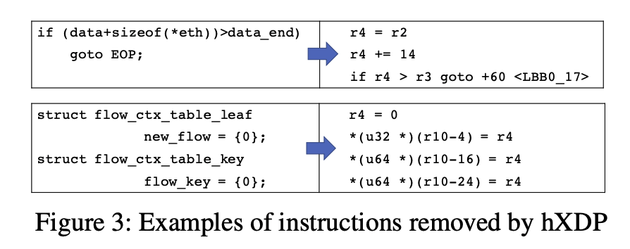

指令替换以降低指令数目例子： 

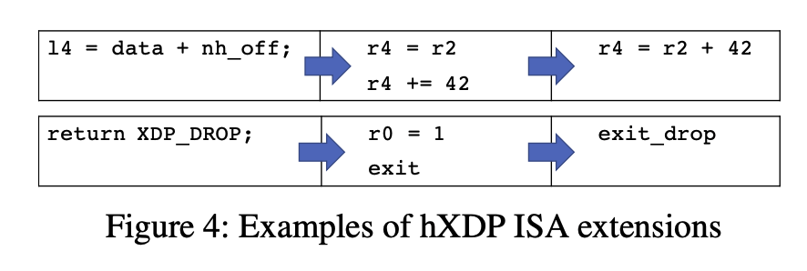

指令并行化例子： 本质是通过静态分析，来确定同一个时间片能够并行运行的指令，进行指令级别的调度。假设并行度为4的话，那么编译器对所有指令分析之后，将所有指令进行分组（每一组最多4条指令），每一组的指令分发到执行器并行执行。（编译器设计涉及到一些编译的技术，例如控制流分析，数据流分析等，实现在后面的技术部分会讲）

**hXDP硬件设计** 

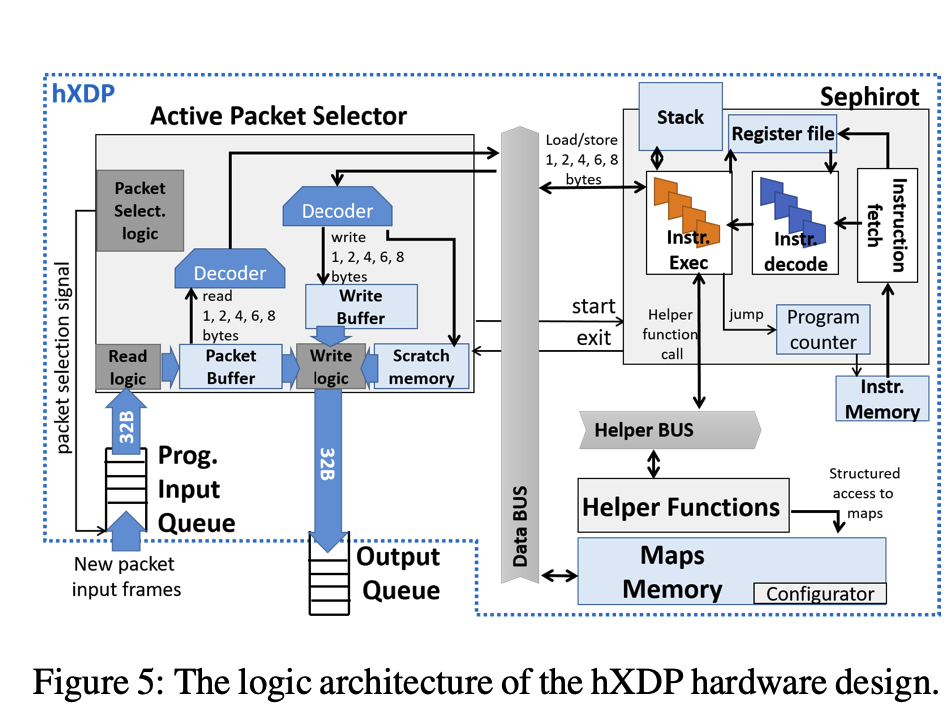

硬件分为 4个模块（由于硬件我并不太清楚只做简单介绍） 

1. Programmable Input queue ， 以frame的格式负责接收并缓存收到的packet 
2. Active Packet Selector 负责讲 PIQ收到的 frame 拼接成完整的packet， 并为 Sephirot 提供 对齐访问packet内存的服务
3. Sephirot ， eBPF程序执行器，执行编译（调度）之后的程序，并行地执行指令组
4. Helper Functions ：**hXDP用硬件实现了部分XDP帮助函数**
5. Maps : **hXDP在硬件上实现了eBPF MAP**

这里的重点在于，如果想要支持特定的MAP 和 helper function, **那么都必须在硬件上进行实现（确保效率，缓存指令的实现方式应该是不可行的)**。因此不管是FPGA硬件卸载还是智能网卡的硬件卸载，设计实现helper function 或者是MAP的硬件模块都是必要的。**想要软件实现MAP的操作，然后直接卸载到硬件上，目前来看希望渺茫，我还没有找到有现成的项目。**

### **Faster Software Packet Processing on FPGA NICs with eBPF Program Warping(ATC 2022)**

这篇文章和上一篇文章是同一个团队发的，是对上一个工作的改进，我简单介绍一下核心idea 

重要观察： eBPF程序可以被划分为简单的部分(只做packet解析)，和复杂的部份（访问eBPF MAP, 调用帮助函数等等）。例如

简单的程序：

只是提取packet字段

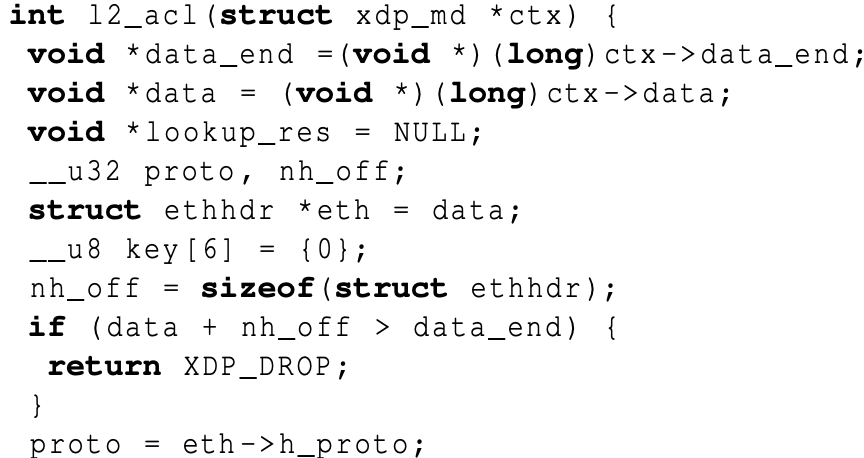

复杂的程序： 

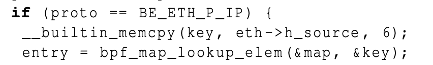

**核心idea** 

将简单的部分和复杂部分进行分离，将简单的部分卸载到更高效的硬件上，剩余的eBPF程序由hXDP执行。

**Design** 

1. 静态代码分析
2. 硬件设计

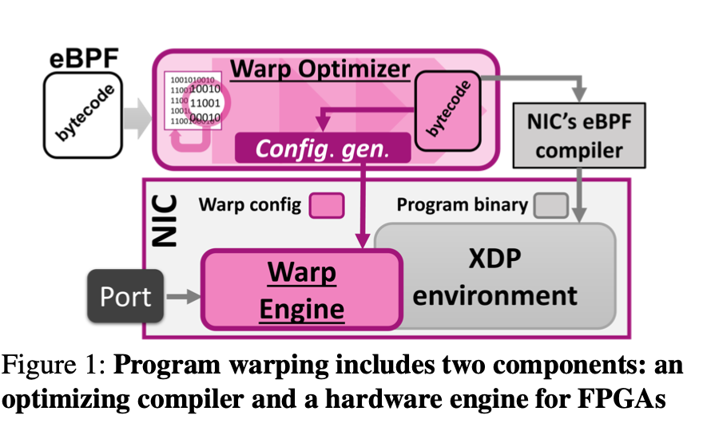

## 技术调研——将eBPF卸载到FPGA

基于上面两篇文献的阅读，以及eBPF大会上硬件卸载topic, 同时查阅了一些开源项目的源代码。对于将eBPF卸载到FPGA上这个问题，下面是简单的调研结果

### 将eBPF卸载到FPGA硬件需要做的工作： 

1. eBPF指令优化/修改(编译层面，但是不一定要改编译器) eBPF的指令集是专门为内核虚拟机设计的，想要在FPGA上设计的eBPF执行环境高效地执行这些指令，显然需要对指令进行一定的修改以及进一步优化。
2. 硬件设计（即在FPGA上设计一个eBPF执行环境） , 这一部分github上可以找到一些开源项目。

### 现有的开源项目

**hXDP** 

介绍的第一篇论文的工作是开源的，编译器，硬件设计(IP核)等

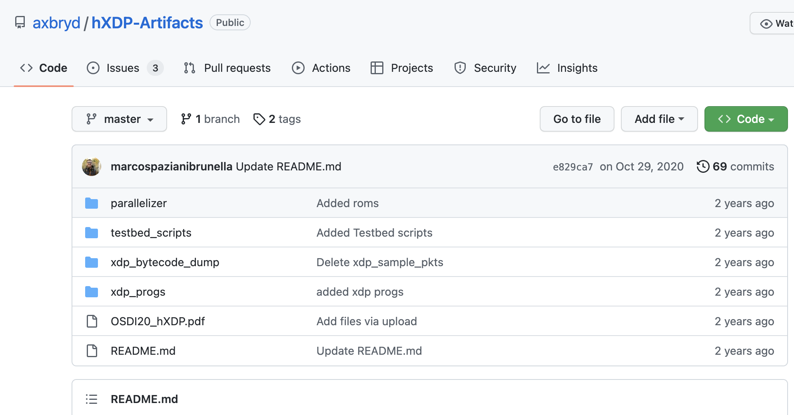

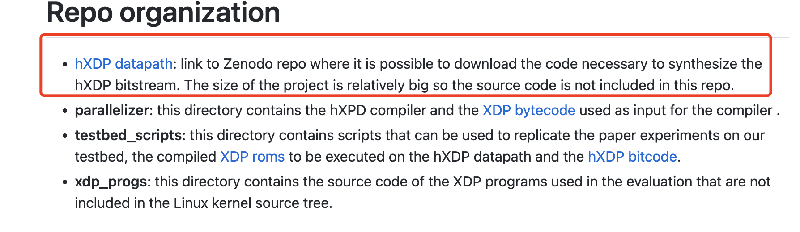

**hBPF**

eBPF硬件卸载开源项目，目前处于初级阶段，设计了一个可以执行eBPF指令的CPU

1. 不支持stack 
2. 通过CPU handle 实现helper function的支持。（即在硬件上实现不同的 handler 来实现不同的 helper function) 

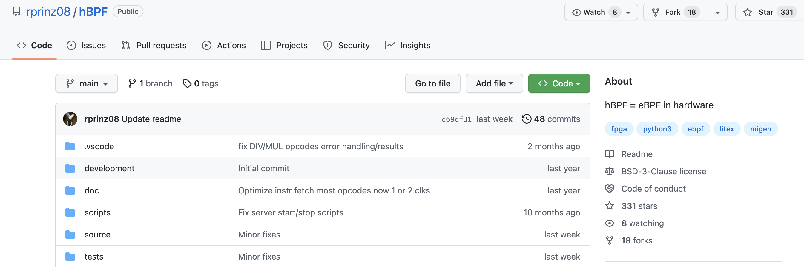

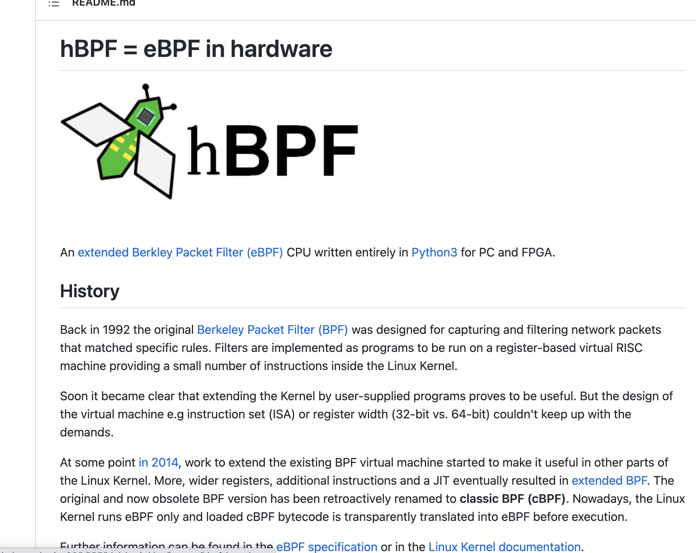

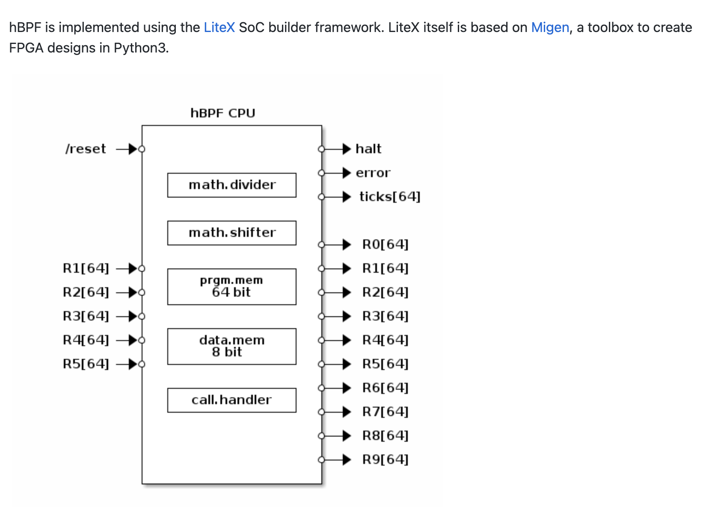

**MagiCore** 

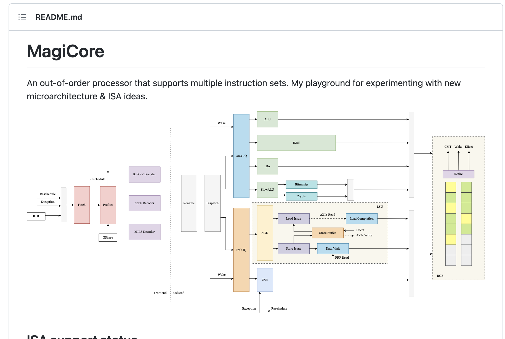

eBPF大会上的项目。

该项目本质上是实现了一个 能够乱序执行+流水线的 CPU, 这个项目能够执行多种指令集。

但根据我此前的分析，它没有helper function 和 MAP的硬件实现，所以应该是不支持Helper function和MAP的。我向作者发了邮件询问，还没有回我。

以上的项目都是开源的，可以基于它们的工作进一步实现硬件。

### 编译器实现

前面提到了，eBPF硬件卸载，进行“再编译”大概率是绕不开的。hXDP和wBPF的编译器部分我简单翻看了源码都是自己实现的，没有使用第三方库。因为它们的工作其实本质上也不是编译器，以hXDP为例：它的实现思路是： 

1. 将eBPF字节码(.o)文件利用llvm反汇编为 .S文件（eBPF指令的文本文件） 
2. 解析文本文件，自己写算法进行控制流分析和数据流分析
3. 根据其论文的算法描述，生成硬件需要的文件数据。

如果要利用已有的库存的话可以考虑，使用llvm提供的接口。

llvm是一个模块化的编译器，其编译流程是，源文件->前端(clang)->IR(中间代码)->后端(llvm)->优化pipeline(基于IR)->目标平台的代码(eBPF字节码)

允许我们可以往它 优化流水线里插入我们自己写的优化模块。（使用c++开发）

因此如果涉及到需要做 控制流分析或者数据流分析，可以考虑直接在llvm的IR层做。但是学习llvm的开发也是一件高成本的事情。

### 硬件实现

基于上面提到的开源项目进行再开发，例如hXDP宣称提供的是已经封装好的IR core。但是不管如何，**如果要增加新的数据结构的话，重新设计硬件是一件必须的事**

### 智能网卡

hXDP文章里实验使用的是我之前调研的那款网卡，我没有找到其他的智能网卡支持这件事。

### 结论

eBPF硬件卸载，需要同时进行软件层面（编译器，驱动程序）和硬件层面的开发。硬件层面可能可以给予一些已有的项目，但是仍然需要开发新的硬件模块，软件层面的开发由于涉及到编译器、编译器和编译相关知识、eBPF指令集的系统学习、内核驱动开发等。目前这方面还比较空白。因此我认为比较难在短时间内实现eBPF硬件卸载。但是解决eBPF硬件卸载的挑战（例如如何增加MAP的支持)我认为还是很有意义的。