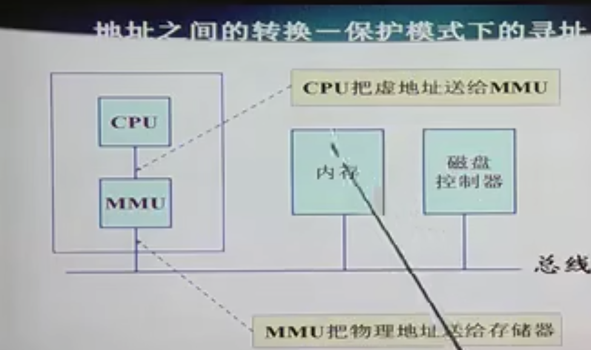
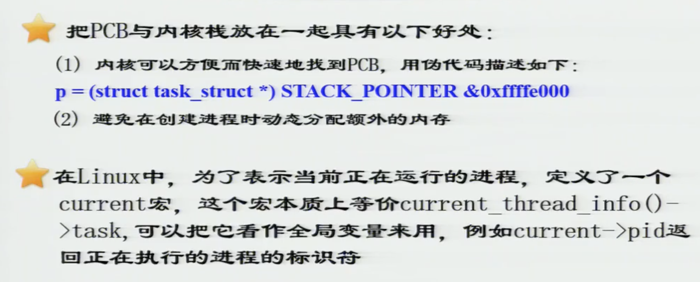

# Linux课程笔记

## Linux链表

include/linux/list.h

双向链表在内核里无处不在，成为了内核的一种基本数据结构

Linux链表可以演变为 堆，栈，队列，rb tree等。链表可以看成一种基本的数据类型

链表的嵌入式设计: 

(在软件设计领域抽象很重要)

""内嵌式设计" 基于 container_of 和 offsetof 这两个内核的宏(宏在内核里个人觉得是最精髓的东西之一)

一个结构体可以有多条链表 (链表的数据结构设计)

### **链表的操作** 

**初始化** (指向自己)

LIST_HEAD宏同时完成了声明并初始化, Linux抽象出了最基本的插入方法 : 

源码下划线表示内部函数

**链表的删除** 

LIST_POISON1 和 LIST_POISON2 (内核地址空间的位置涉及内核管理)

**链表的遍历** \

(链表有头节点)

**嵌入式链表** 

container_of ，从成员位置找到结构体起始地址 (现在应该都封装了 container_of offsetof这些宏)

1. 先计算成员的偏移量
2. 用 成员ptr - 偏移量 n 

ptr是 struct list_head 的实际的地址， type是包含 list_head的结构体， member 是 list_head结构体的名称

safe遍历

这个版本, n提前缓存下一个节点，如果在  list_for_each 的过程中用 list_del删除 pos , 由于存在n缓存，不会出现问题。(原来的版本， 因为 del pos，之后 pos->next 会出现问题)

# 内核内存

## 内存管理的硬件机制

EIP存放下一条将要执行指令的偏移量，相对于CS而言。

存放标志位的寄存器

用于分页机制的控制寄存器 

**不同类型的地址** 

物理地址，虚拟地址(段：偏移量)， 线性地址空间是**不分段**的范围是0-4gb（32位），也就是一维地址。

硬件相关代码和硬件无关代码必须有一个清晰的界限。

段机制

段描述符表，段表

其他不同的描述符表

cache机制

不是所有的CPU都支持段机制，但是基本都支持页机制，Linux段机制很简单，各个段的基地址是 0 因此偏移量等于线性地址

所以段是可以 overlap的？ 

* 线性地址空间划分为page

* 物理地址空间划分为page frame (为什么叫frame)

线性地址空间是连续的，但是物理地址空间可能是不连续的

page size --> Os + kernel 正常是4k 

页表项 --> 起始地址 + 页的属性。 

基地址 2^20 

20位基地址 + 12位属性。 （硬件设计)   多级页表把 20位拆开。12位 脏位 U , 权限等

多级页表。 防止页表太大的问题。 

MMU是硬件机制（分页分段这些机制是硬件提供的) 

## 内存管理

 

kallsysms 内核所有符号对应的地址 

是很有可能会有若干个代码段和数据段

整体的内存空间用 mm_struct, vm_area_structs 对虚拟内存区(代码段，数据段，堆栈段)来对进程内存空间进行描述

rb_root_t mm_rb :  用红黑树来组织  妈妈?  还是组织 mm_struct 

mmap_cache 缓存

pgd_t * pgd;  页表描述符 （虚拟地址映射到物理地址) 

start_code ，end_code, start_data end_data 代码段的地址

mmap (把文件映射到地址空间中)

对所有的进程都使用统一的数据接口进行描述

mm_struct建立内存空间，但是真正用到的时候再给内存

mmap 映射的空间用 vm_area_struct来描述？ 

匿名区可能是堆或者栈

mmap相当于创建一个 vma

## 进程

两个程序之间的二进制接口

应用程序和操作系统之间（库）的二进制接口 。(ELF格式之间的协商？)

0 号进程 ---- swapper 

1 号进程----- init （systemd)

(linux有9种)

**进程控制块** 

TASK_RUNNING 对应就绪态

volatile 可以查 GCC手册

一般来说 systemd是养父 (孤儿进程)

<linux/shce.h>

### 进程控制

task_struct 

如何存放进程控制 (motivation是进程的task_struct是很大的有几百个字段)

内核栈和用户栈

新进程同时分配了内核栈， 把PCB和内核栈放一起可以很快地找到PCB。 

current宏是一个全局变量

通过kallsysm直接访问地址内容(学习)

0 号进程是链表头

init_task 也是一个全局变量。

init_task可以使用进程链表。

进程可以使用哈希表的方式组织 (不同的namespace ? )，使用pid。

## 调度算法 

进程发生调度的时间 ：  **（状态机切换的时候发生调度）**, 需要调度的时候设置标志位。

**从内核态返回到用户态的时候** 会发生调度 。 （调度程序在内核态执行）

进程的时间片是如何计时的？ 动态优先级--->时钟计数 counter用于表示剩余的时间片

（PCB字段 2.x内核)

用户线程和内核线程 (实体是一个函数)  内核地址空间使用 struct_mm来表示

调度函数 scheduler 

为什么要有 prev 因为 current 是全局变量，先用prev把current保存下来，不要随便改变全局变量的值

操作系统底层是状态机? 

## 中断

硬中断。中断线共享数据结构

主设备号和副设备号  rtc (时钟设备)

用struct包一个字段。

有一些硬中断是可以被共享的。

Linux中断的核心函数是 do_irq -> handle_IRQ_event 

### 中断下半部 

分成上下两部分，上半部分是中断处理程序，执行速度很快。下半部分执行慢操作。

1. 软中断。(softirq_action)  
2. workqueue (节能)  将工作退后执行的形式 交给一个内核线程执行 允许睡眠(IO )  (work_struct)  有专门的线程在执行
3. tasklet  小任务

### 时钟中断

实时时钟  (RTC) 和 操作系统(OS)时钟

实时时钟也叫硬件时钟，靠电池供电。

节拍，每发生一次时钟中断

jiffy

定时器用 timer_list维护。 

init_timer()

激活

..

内核在时钟中断发生后执行定时器，作为软中断在中断下半部执行 