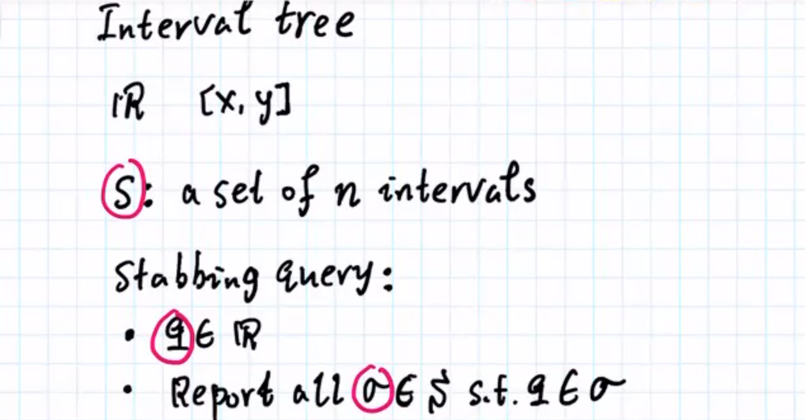
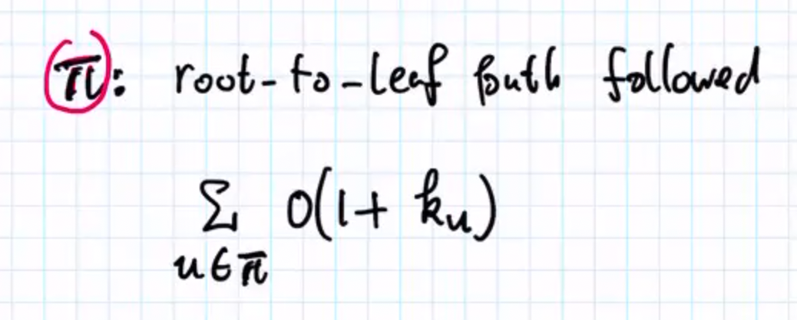
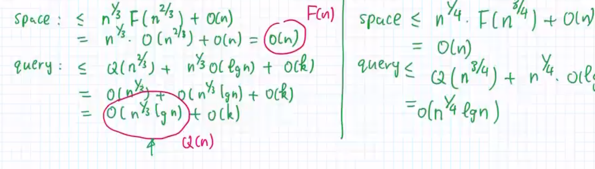
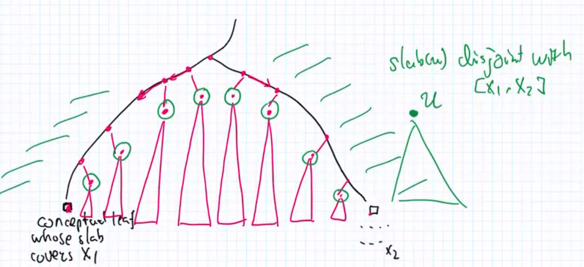

# 高级数据结构课程笔记 

数据结构 ： 1. 存什么数据 2. 操作

## L2 BST

S. : a set of n real values 

* one-one mapping bettwen element(key) and note
* key(u)
* level 
* height : level  + 1

1. Insert / delete 
2. predecessor :  最大的 <= Q的元素  predecessor(Q)  类似于 STL 的 lower_bound 和 upper_bound  （log(n)

3. successor : 最小的 >= Q的元素 
4. range reporting。  I = [x, y]  返回 S 并 I  

5. 最大/最小。(log(n) （最左边和最右边) 

6. **split** x 从 x 这个位置把 tree 切开分成两棵树 (logn)

   

7. 把两颗满足要求的子树组合成一棵子树 (logn)

   

**一棵树有 x 个节点那么一定会有 x+1个虚拟节点。每一个虚拟节点代表了一段 interval. （9个节点将一个无线的线段划分为了10份)** 

slap(x) 可以简单理解为 x 为根的子树对原有的树来说的范围。比如 slap(40) = [20, 50) 也就是这颗子树的所有节点的值都在这个范围里 

 虚拟节点也可以计算 slap , 虚拟节点的 slap 也就是物理节点划分得到的 interval 。（感觉区间树)

很关键没有祖先关系的节点 slap 是 不相交的

count (log(n))

range counting.  返回符合范围的元素个数  log(n) (使用 slap来证明)

split可以转化为join的操作

e

2和3看成一棵树

把 split转化为join 

两个最小的高度的树开始 join 按照最差的情况

## L3 interval tree

 

How to deal with classical problems 

提出这个方法的原始的idea 

对于一个值， 有 3 种interval : 

1. interval 都在 q 右边
2. 都在 q 的左边 
3. 可能包含q 

可以忽略蓝色的 

黑色的 查找 stabbling list  O(1+ku)

只需要查找 leftend point 即可 因为 一定是包含 节点的 节点  > q 

处理红色的部分 ： 递归地查找下一个节点。 

递归看看你的处理是否符合所有的场景 (senario )

时间复杂度： 

no interval will be reported twice 

## SEG-TREE 

space O(nlgn)

qry  O(lgn + k) 

[x, y)

每一个节点挂着 分割后的 intervals (log(n)) 标准化分割引理

直接把路径上 节点的 set report  S(u)  

1. 路径上的每一个节点 u slap(u) 都包含 q (查询的值)

对于节点 u, S(u) 里的每一个 interval 都包含  slab(u) ， 并且 slab(u) 一定包含 q。所以只需要把搜索路径(log(n))节点上的 S(u ) 打印出来即可。因此搜索路径一定包含q

interval 只会被report 一次。因为 interval 被划分为不相邻的多个 slap, 如果在同一个路径上出现了两次，那么说明这个interval 被划分的这两个slap 重叠了，这不符合lema的要求。（一条路径上，祖先节点的slab 包含孙子节点的 slab） 

却别，上一个 interval tree 是吧 interval 挂在节点上，每一个interval 只能挂一次。而 segment tree 把 interval 挂在 partition 后的节点集上可以出现多次。（这两个idea可能需要再仔细体会一下)

## kd-tree 

BST可以解决一维的查找

时间和空间的tradeoff。 point-based structure ，这种 tradeoff 已经是最好的，不可能达到 log(n)的时间复杂度

(右边是 d 维)

general posistioon assumption (没有两个点有相同的 x 或者 y)

n个点可以找到一条线 l. 把这 n 个点 尽量均匀地分成两份。

垂直分->水平分->垂直分...

(第一刀是垂直分)

minimum bounding rectangle (MBR) 最小的平行正方形能够覆盖这颗树上的**所有点**。 （感觉和 slab的概念优点像但是不完全一致) 

给定 范围 q 

搜索策略，只搜索MBR和q有交集的节点。

这种搜索策略的时间复杂度是  $O(\sqrt{n} + k)$

证明 : 

有个很有意思的思路，先考虑极端情况 + 递归 然后就可以用 master 定理证明了 。

如果 q 是水平线和垂直线类似

每条线 intersects  $O(\sqrt(n))$个点

type1 ，MBR至少和q其中的一条边代表的直线一定会相交

type2 很简单因为已经包含了，只需要把这棵树下的所有的叶子节点 report 就行了。O(k)

## Bootstrapping 

把数据结构A 当成一个 黑盒， **基于A 设计数据结构B** 

以 kd-tree 为例。

极大地改进了 kd-tree的性能。

然后给予这个新设计的数据结构，再设计一个数据结构。不断迭代，也就是 bootstrap 的含义。

 

核心 idea 

把所有的点分成 $\lambda$ 份个slab。对于查询区域q，和slab相交会有两种类型，1. 部分相交（红色部分）2. 完全覆盖（蓝色部分） 

红色部分应用原有的数据结构，蓝色部分由于x都在范围内，所以只需要考虑y轴，把二维查询转化为1维查询 (可以使用 2-3 tree)

## priority search tree 

1. 改变问题的本身。 3-sided query  (一维查询是其中的一种特例。)
2. 放松空间的限制

approach1

approach2 

一个简单的数据结构 mak_heap 

every type2 node must have a type a parent. 因此可以转换问题。 有 k 个 type1 node, 最多有 2k个 type

2 个孩子。因此最多需要access 3k 个点

slab : what is the key range the rode is responsible for (the entire subtree)。（一维，如果是二维 是一个 box) 

**Priority search tree / treap** 

pilot point 。 根存储 highest point 

slab(xl) : 

根据这种建树规则 (pilot)，red点是一棵y轴上的 mak heap 

**在x轴上的二叉树，在y轴上其 pilot 点是一棵max heap** 因此叫做 treap 。很巧妙！ 

如何查询。3-sided box 

抽象思维 不要只通过例子学子。

slab : 如果两个点不在一条路径上，那么它们的slab就不会相交。

step 1 :  在 x轴的二叉树上查找

x1 和 x2 之间的点，例如 xg xc xb 的 slab 范围都早[x1, x2]内， 

在 x1 和 x2 之外的 slab 可以被忽略 （红色的部分) 

通过 BST确定 x 轴的范围之后，只需要再确定 y 轴的内容。因此只需要在搜索 pilot tree即可，类似于 max_heap 的 range search。 因为我们是 three sided query。 >= y

1. left turn in the left part take the right child tree (all fall into [x1, x2])
2. right turn in the right part take the left child tree

如下图

step2 : answer  确定 y轴的范围 (pilot 点构成的 max heap) (report the pilot point which node's pilot point can fall into query)  （降维) 

1. 在刚才的路径上 （已经访问过了，没有额外的开销）  
2. 中间的红色部分

在进行第一步骤之后，查找 pilot point 构成的 max heap (pilot point 根据 x 轴已经满足要求了)。问题转化为前面 max heap 的 range query 问题。

可以实现 lgn + k 不一定要是 lgn (这一部分在一定程度上已经包含了 ouput )

## range tree 

思路，将查询分解

1. 先查x轴
2. 再查y轴

primary BST + secondary BST 

secondary Tree所需要的空间和 |Su|的大小相关

空间复杂度的证明 ： 每一个点最多出现在 logn 棵 secondary 树上。总共有n个点，因此 secondary 需要 nlogn ，所以送的空间复杂度是 O(nlog(n))

## pointer machine structure

(linux list head? ) array 就不是 pointer machine   : why pointer machine is so important in computer science. (指针!!!!)，因为内存很多空间往往都不是连续的。

## Dynamization 

static: No insert and delete 

interval-tree, PST, segment-tree, range-tree, kd-tree (之前弄的一些数据结构是static 数据结构)

semi-dynamic :  Ins only (1. 很多时候 插入更重要, 有时候甚至都没有delete, 例如 log 或者 time-related data 2. 考虑semi-dynamic更加简单 beautiful simple algorithm)

fully-dynamic: Ins and del 

amortized (总的cost, 而不是 per-udapte) , 平摊， 分摊

在 amortized bounds 里，a bound of the long sum (total bound), 每一次的 n 都不一样

所以下面那里用的是 |Si| 而不是 n 

1. 任意的 data
2. 最差的 seq
3. 任意的 m 

### charging argument 

reason about amortized cost 

How to apply "charging argument "

平摊分析，把一个大的操作分散到很多个小的操作。所以叫做 charging 

how many time every update is charged。

选择合适的op charge 让整体的开销最小。 （比如原本是 n , charge 一个 logn上去，变成 n + logn 或者 n+n, 整体来看还是 n ? ) 

 global rebuilding (destroy everything and rebuild the structure)  比如 vector, deque 

**dynamic array** (vector)

do it periodcally, 获得一个整体上较小的开销（平摊）

insertion  O(1) amortized

（普通的证明方法） 

break a expensive operation and spread it out to many operations 

argument charging 

How many times ci of the insertion will be charged , 所以选择 charged 的 op 很重要。（每一个op只被 charge 1 次 for global rebuilding）， charge 太多次就不行了。 

如果 ci 很小 什么都不需要做。如果 ci 很大。那么需要平摊。

不过有一个问题，平摊从总体上来看 开销不到，但是无法确保 bounded latency ，需要从实现上把操作上平摊下去。

**要很好地选择 j , 确保 被 charged 的 operation 不会被 charge 太多次。从而保证从整体上 操作的开销还是很小。（把cost平摊了）** 

**这只是一种算法分析，如果能够从实现上也能保证平摊的操作，那么也能够保证 bounded latency.** 

(就这个dynamic array来说，我们实现就可以同时维护两个数组。)

## semi-dynamica

Decomposable queies 

s1, s2  (disjoint)

获得了 Ans(s1) 和 Ans(s2) 那么可以以极低的代价获得 Ans(s1并S2)

short message : 

fast construction => fast insertion 

Turn your strc to dynamic strc for free 

只需要设计一个 static structure  然后通过某种方法转化位 dynamic sturcture 

 **global building 在实践中是一种很有效的方案。**

方法： 

**阶段性 reconstruct** 

**同时保留多个数据结构**

 

n 对应着二进制位 

8 1000

7    111

6    110

周期性地rebuilding ,  然后再用平摊分析，把rebuild操作的cost 平摊到每一步的操作中 （具体怎么分析） 

**move all the structure smaller than Ti and reconstruct Ti (if Ti not exist ) **其实就是二进制进位的原理。

## Dynamization Logarithmic method

query : search all the structure 

insert 的开销主要在于 rebuild 的开销。根据算法的描述, 对于每一次 ins，rebuild $Ti$  on S ($|S| = 2^i$)（$2^i$个点) 时间复杂度是

$O(2^ilgn)$  。那么把整体的开销分摊到 Ti 上的所有点。平均每个点被分到了 logn。 对于同一个点来说，当他被charge的时候，这个点从 Tk (k < i) 的数据结构 被搬到了 Ti. 并且根据该算法，只会合并成更大的，“不可能从一个大的分解成多个小的”因此，最多搬动 lgn次。

T0->T1->T2->T3...->Tlng 所以最多被charge logn 次。

**思考（如何基于这个分析进行实现？感觉无法实现因为它只能 rebuild）**

比如 当 n = 8 时候

rebuild T3, charge 到 1-8 个点

当 n = 6时候 rebuild T2 , 只 charge 点 5 和 6
