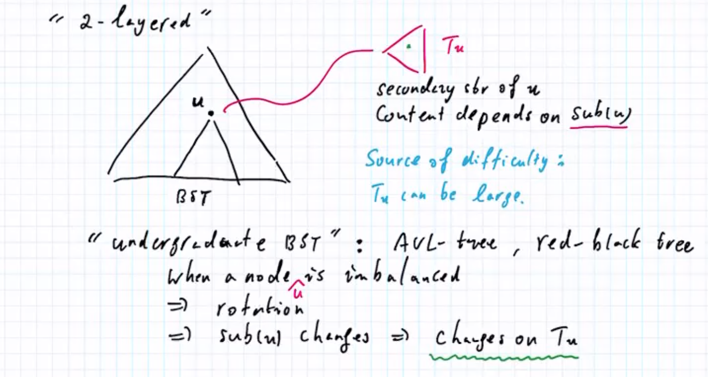
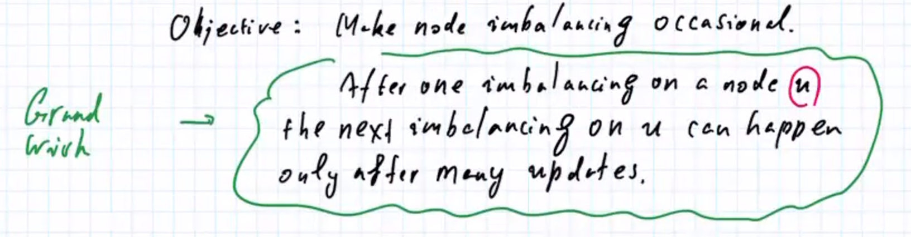
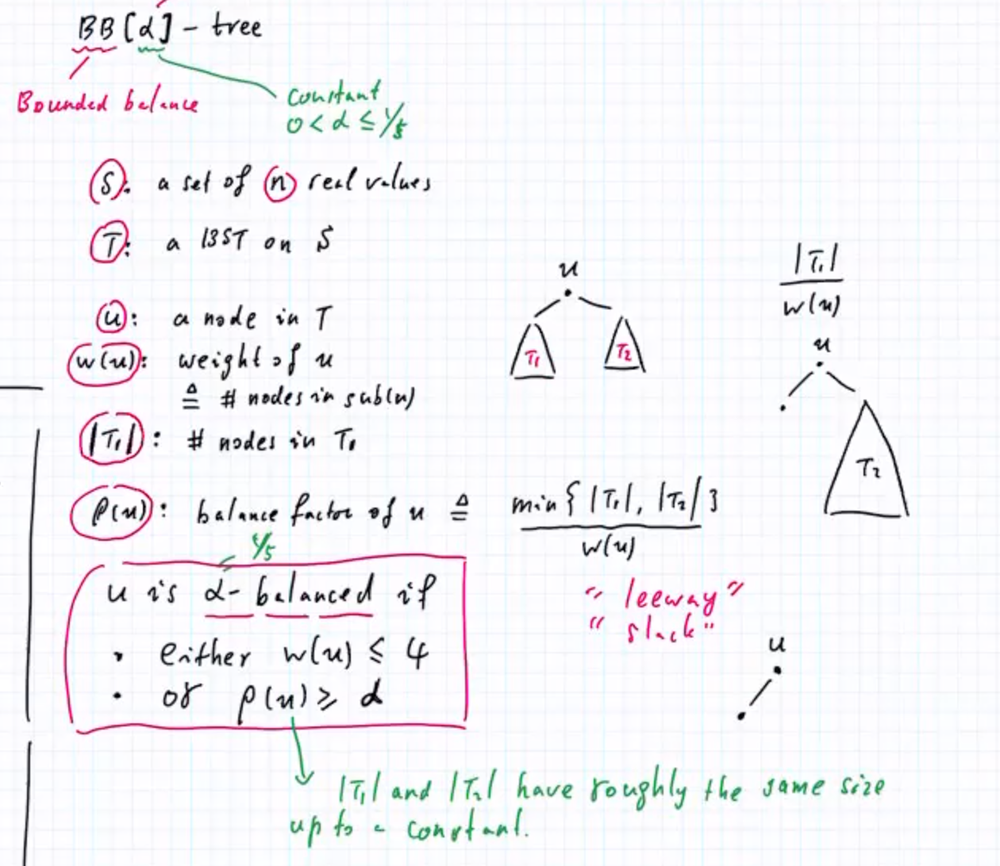
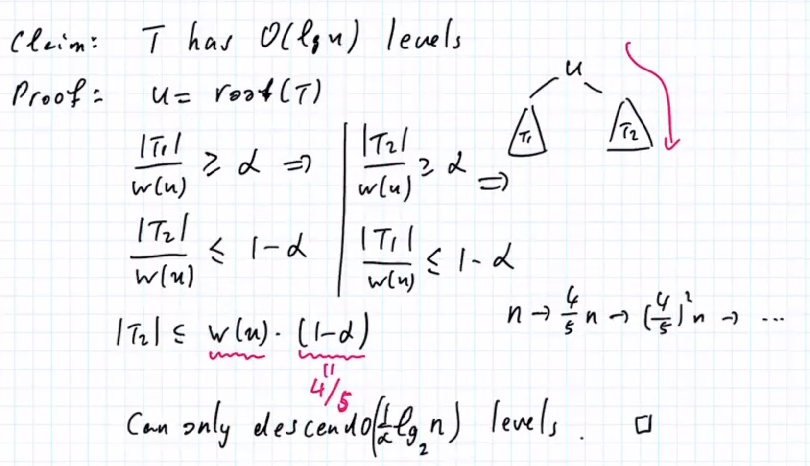
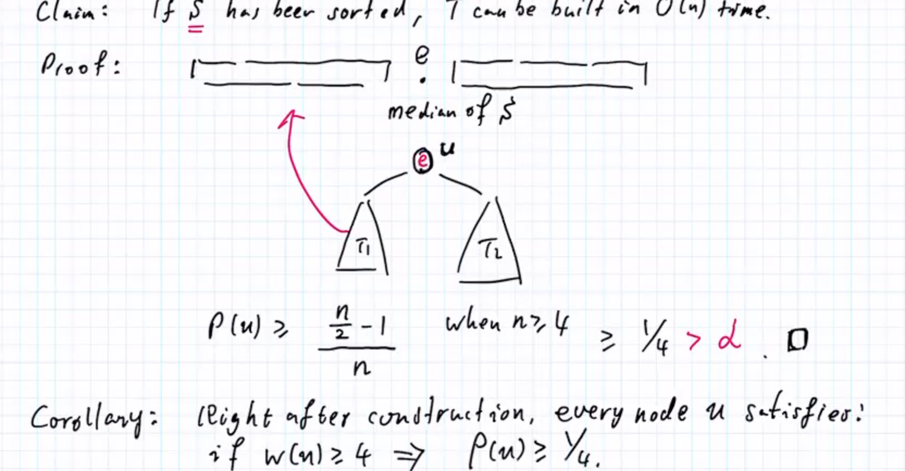
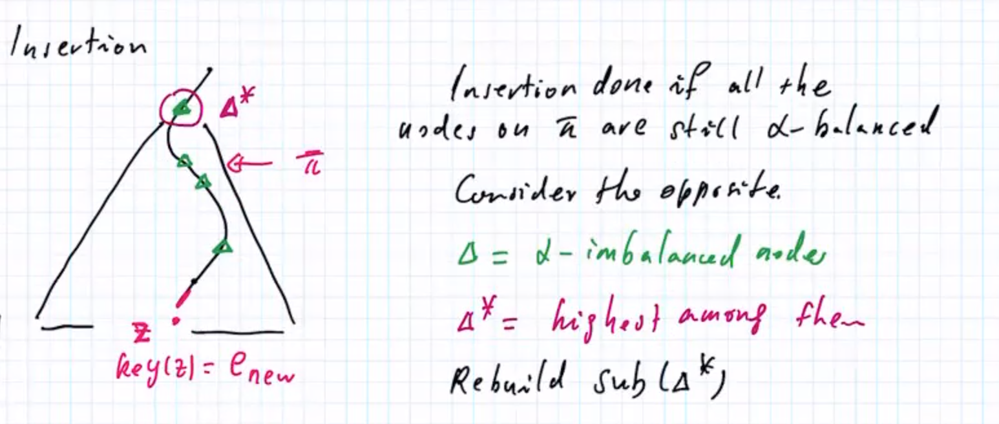
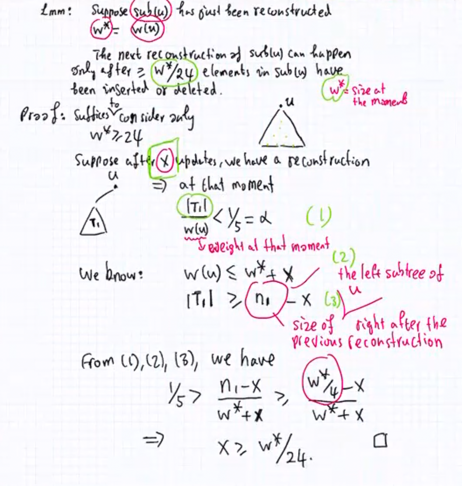
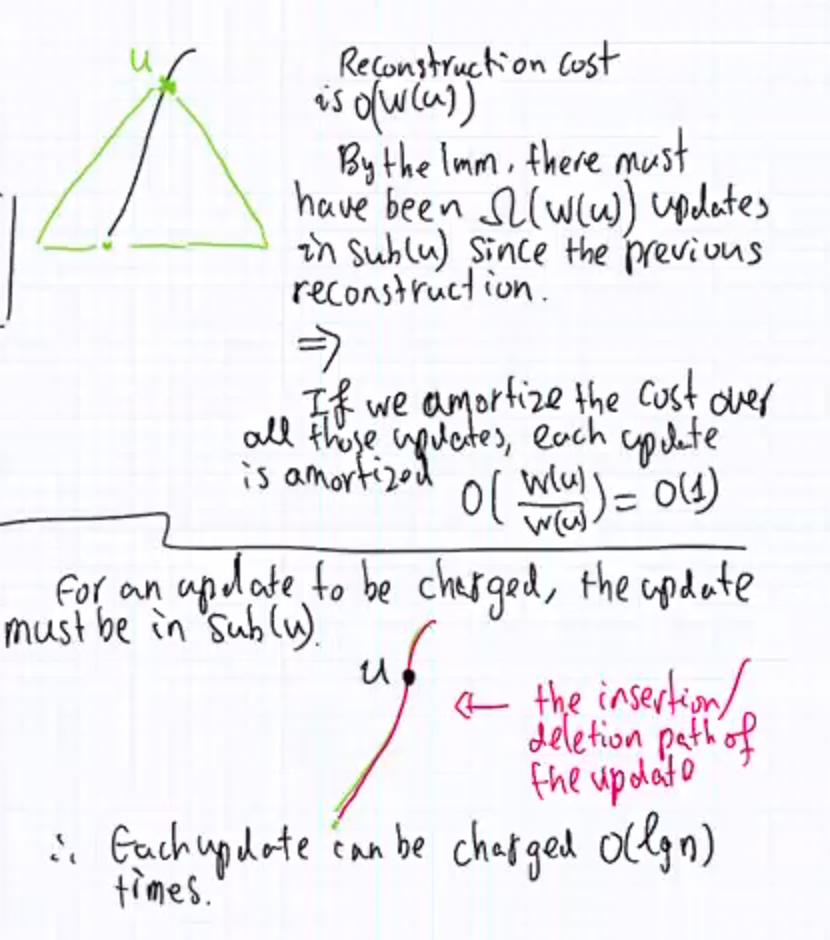
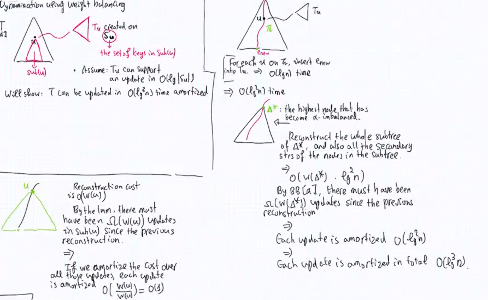

# 高级数据结构笔记2

## weight balancing

purpose: fully dynamic a data strc

the culprit is BST itself.

因为二叉树经常变得不平衡，所以需要进程更改tu但是tu的大小是不可控的。

core idea : make node inbalancing very occasional. (imbalance not happen every time)。after one imbalacing on a node u, the next imbalancing on u can happen only after many updates.

rebuilding  

=> "Graduate-level"  BST. weight-balanced BST

**1:1 和固定的 1:4 没有太大的区别（如果比例是固定的话）** constant is a good friend for computer science. just fine

what is not that different to the perfect 

 

T is a BB[a] -tree if all the nodes in T are a-balanced 

decrease a level of 1/5。 只要是常数就行

inserst: reconstruct 

you don't have to pay this all the time, the total cost we pay is not very high (平摊之后还是logn)

根据DFS搜索子树就可以获得该子树

**constant gap between 1/4 and 1/5, this is crucial** when the subtree are rebuilt you have more better than required 

删除最终看成删除一个叶子。(因为删除中间节点，需要选一个节点填上去，最后就会变成删除叶子结点)

插入和删除的复杂度平摊后是 lgn 

**salient 在一次reconstruct之后，只有在若干个 update之后才会再次reconstru  ct** 

对于一个更新，只有路径上的的点能够 charge该更新 (charge发生在两次reconstruct 之间)，路径长度为log(n)

